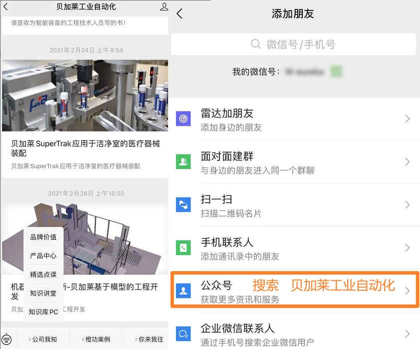
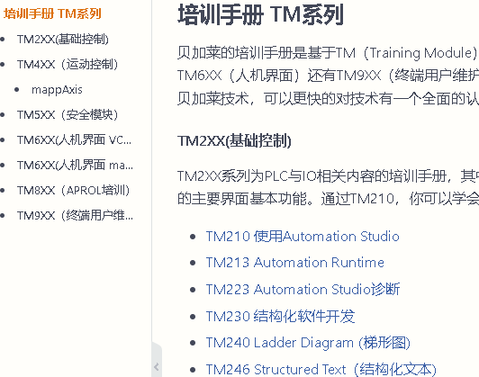
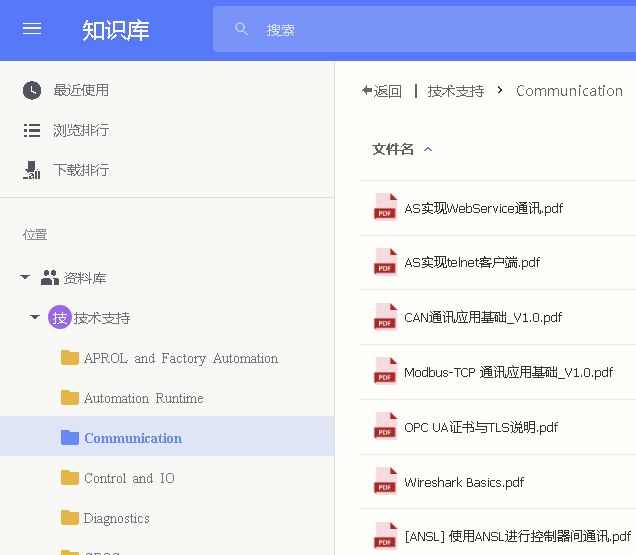

> 001_贝加莱信息了解

> Tags: #入门

- [1 官方微信公众号](#1%20%E5%AE%98%E6%96%B9%E5%BE%AE%E4%BF%A1%E5%85%AC%E4%BC%97%E5%8F%B7)
- [2 贝加莱官方网站](#2%20%E8%B4%9D%E5%8A%A0%E8%8E%B1%E5%AE%98%E6%96%B9%E7%BD%91%E7%AB%99)
- [3 技术支持联系方式](#3%20%E6%8A%80%E6%9C%AF%E6%94%AF%E6%8C%81%E8%81%94%E7%B3%BB%E6%96%B9%E5%BC%8F)
- [4 AS软件下载与使用](#4%20AS%E8%BD%AF%E4%BB%B6%E4%B8%8B%E8%BD%BD%E4%B8%8E%E4%BD%BF%E7%94%A8)
- [5 学习资料](#5%20%E5%AD%A6%E4%B9%A0%E8%B5%84%E6%96%99)
	- [5.1 贝加莱培训手册下载（推荐）](#5.1%20%E8%B4%9D%E5%8A%A0%E8%8E%B1%E5%9F%B9%E8%AE%AD%E6%89%8B%E5%86%8C%E4%B8%8B%E8%BD%BD%EF%BC%88%E6%8E%A8%E8%8D%90%EF%BC%89)
	- [5.2 贝加莱PC知识库](#5.2%20%E8%B4%9D%E5%8A%A0%E8%8E%B1PC%E7%9F%A5%E8%AF%86%E5%BA%93)

# 1 官方微信公众号

- 官方账号添加方式：
    - 添加方式在微信软件中，点击 **添加朋友** — 公众号 — 搜索 “**贝加莱工业自动化**”
  - 

# 2 贝加莱官方网站

- www.br-automation.com

# 3 技术支持联系方式

- （1）官方技术支持回复可请邮件至：[support.cn@br-automation.com](mailto:support.cn@br-automation.com)
  - 邮件中描述问题外，请注明姓名+公司或学校名+联系电话或手机号。以便我方工作人员顺利解决。
- （2）电话 **021-54644800** 至技术支持部

# 4 AS软件下载与使用

- 1）AS4.1及以下版本免授权，可以随意安装使用：[Automation Studio V4.1 | B&R Industrial Automation (br-automation.com)](https://www.br-automation.com/en/downloads/software/automation-studio/automation-studio-41/automation-studio-v41/)
- 2）AS4.12 目前是贝加莱最新的AS，需要在线申请90天授权:
    - [Automation Studio V4.12 | B&R Industrial Automation (br-automation.com)](https://www.br-automation.com/en/downloads/software/automation-studio/automation-studio-412/automation-studio-v412/)
    - 90天授权申请链接 [Automation Studio授权](https://www.br-automation.com/zh/service/software-registration/automation-studio-licensing/)
    - 安装完成Automation Studio后，请务必对应AS大版本（例如AS4.12）的最新的SP包（4.12.4）来优化使用体验
        - [V4.12 AS Upgrade (4.12.4.107_SP) | B&R Industrial Automation (br-automation.com)](https://www.br-automation.com/en/downloads/software/automation-studio/automation-studio-412/v412-as-upgrade-4124107-sp/)
- 3 ) 🛑若AS软件安装过程中发现任何问题，请点击以下链接查询可能出现的解决方式
    - [000C02_AS软件注册与安装问题](../C02_AS软件注册与安装问题/000C02_AS软件注册与安装问题.md)

> 📋Automation Studio软件使用说明，可查看以下链接 [000B01_技术_AutomationStudio](../B01_技术_AutomationStudio/000B01_技术_AutomationStudio.md)

# 5 学习资料

## 5.1 贝加莱培训手册下载（推荐）

  - [可点击选择所需下载](003_贝加莱TM手册下载.md)
  - 

## 5.2 贝加莱PC知识库

- **[贝加莱资料库（推荐）](http://brtech.huashengyun.online/)** 🏢
- 贝加莱全方位的文档与介绍资料，可以从中找到任何你想要的资料。
  - http://brtech.huashengyun.online/
  - 
