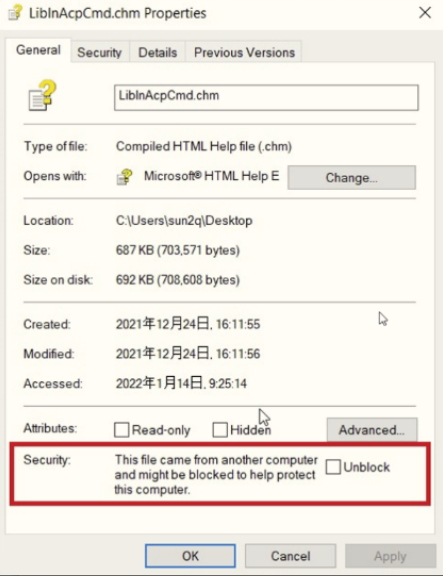
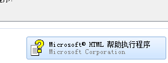
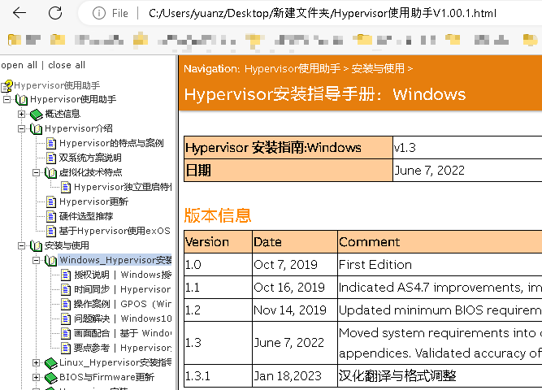

> 002_CHM文件使用说明

> Tags: #CHM

- [1 为什么选择CHM](#1%20%E4%B8%BA%E4%BB%80%E4%B9%88%E9%80%89%E6%8B%A9CHM)
- [2 使用建议](#2%20%E4%BD%BF%E7%94%A8%E5%BB%BA%E8%AE%AE)
- [3 FAQ](#3%20FAQ)
	- [3.1 Q0：如果实在打不开CHM文件但又觉得PDF文件看起来不方便，可以使用eWriter文件](#3.1%20Q0%EF%BC%9A%E5%A6%82%E6%9E%9C%E5%AE%9E%E5%9C%A8%E6%89%93%E4%B8%8D%E5%BC%80CHM%E6%96%87%E4%BB%B6%E4%BD%86%E5%8F%88%E8%A7%89%E5%BE%97PDF%E6%96%87%E4%BB%B6%E7%9C%8B%E8%B5%B7%E6%9D%A5%E4%B8%8D%E6%96%B9%E4%BE%BF%EF%BC%8C%E5%8F%AF%E4%BB%A5%E4%BD%BF%E7%94%A8eWriter%E6%96%87%E4%BB%B6)
		- [3.1.1 下载地址](#3.1.1%20%E4%B8%8B%E8%BD%BD%E5%9C%B0%E5%9D%80)
	- [3.2 Q1：CHM发送给其他人无法打开例如，例如通过Teams发送后，CHM有目录但其他内容一片空白。](#3.2%20Q1%EF%BC%9ACHM%E5%8F%91%E9%80%81%E7%BB%99%E5%85%B6%E4%BB%96%E4%BA%BA%E6%97%A0%E6%B3%95%E6%89%93%E5%BC%80%E4%BE%8B%E5%A6%82%EF%BC%8C%E4%BE%8B%E5%A6%82%E9%80%9A%E8%BF%87Teams%E5%8F%91%E9%80%81%E5%90%8E%EF%BC%8CCHM%E6%9C%89%E7%9B%AE%E5%BD%95%E4%BD%86%E5%85%B6%E4%BB%96%E5%86%85%E5%AE%B9%E4%B8%80%E7%89%87%E7%A9%BA%E7%99%BD%E3%80%82)
	- [3.3 Q2：打不开CHM文件常见解决方式](#3.3%20Q2%EF%BC%9A%E6%89%93%E4%B8%8D%E5%BC%80CHM%E6%96%87%E4%BB%B6%E5%B8%B8%E8%A7%81%E8%A7%A3%E5%86%B3%E6%96%B9%E5%BC%8F)
	- [3.4 Q3：不能打开文件提示mk:@.chm”](#3.4%20Q3%EF%BC%9A%E4%B8%8D%E8%83%BD%E6%89%93%E5%BC%80%E6%96%87%E4%BB%B6%E6%8F%90%E7%A4%BAmk:@.chm%E2%80%9D)
	- [3.5 Q4：CHM怎么都打不开，可以使用CHM decode把CHM转换为HTML文件](#3.5%20Q4%EF%BC%9ACHM%E6%80%8E%E4%B9%88%E9%83%BD%E6%89%93%E4%B8%8D%E5%BC%80%EF%BC%8C%E5%8F%AF%E4%BB%A5%E4%BD%BF%E7%94%A8CHM%20decode%E6%8A%8ACHM%E8%BD%AC%E6%8D%A2%E4%B8%BAHTML%E6%96%87%E4%BB%B6)
	- [3.6 Q5：Hhctrl.ocx文件版本不对](#3.6%20Q5%EF%BC%9AHhctrl.ocx%E6%96%87%E4%BB%B6%E7%89%88%E6%9C%AC%E4%B8%8D%E5%AF%B9)

# 1 为什么选择CHM

- CHM 虽然陈旧，但**简单、灵活、有效，目录、索引、查找这些功能用起来又很方便**——很多电子书都是以 CHM 格式出现的。事实上，仅就屏幕阅读效果来说，很多时候它比 PDF 格式更合适——PDF 更适合打印输出。
- CHM文件在**手机**上阅读非常便利，可以切换目录，调整字体大小。

# 2 使用建议

- 对于iPhone手机/iPad设备，推荐使用**CHM Sharp**软件。
    - 
- 对于安卓Android设备，推荐使用**掌阅 iReader**
    - 

# 3 FAQ

## 3.1 Q0：如果实在打不开CHM文件但又觉得PDF文件看起来不方便，可以使用eWriter文件

- 文件后缀名为.ewriter，安装完成软件后，双击直接启动。
- 

### 3.1.1 下载地址

- [Free Windows EXE eBooks and eBook compiler (helpandmanual.com)](https://www.helpandmanual.com/ewriter/index.html)
- 百度网盘下载地址：https://pan.baidu.com/s/1GdBRGRJa0PTHjQWDeMTXvQ?pwd=f1ht

## 3.2 Q1：CHM发送给其他人无法打开例如，例如通过Teams发送后，CHM有目录但其他内容一片空白。

- A:基于安全考虑，微软的操作系统可能会禁止从网上直接下载的 CHM 文件直接打开。
- 解决的办法有两个：
    - 先把 CHM 压缩再上传到网上，下载后解压缩出 CHM 文件
    - 在“文件属性”中“解除锁定”即可
- 用鼠标右键单击下载的 CHM 文件，在弹出的快捷菜单中选择`属性`菜单项，然后在`常规 General`选项卡底部Security找到`解除锁定UnBlock`按钮，点击之后再按`确定`按钮即可。
  - 

## 3.3 Q2：打不开CHM文件常见解决方式

- 试试改文件名和所在目录为英文名称或是非法文件名  如：Performance Tuning for Linux® Servers.chm应改为Performance Tuning for Linux Servers.chm
- 放在英文路径下，并且把chm文件本身也改用英文命名
- 鼠标右键单击该CHM文件，在右键快捷窗口中选择“打开方式”-“Microsoft HTML Help Executable”；
    - 
    - 如果出现一个提示窗口，大意是说，该CHM文件的发行商未知等，是否确定打开。请一定要将“每次都提示该窗口”的复选框的勾去掉！否则就会出现“该页无法显示”的情况。
    - 打开后，内容区就显示正常了！以后直接双击该CHM文件，就可以正常显示了！

## 3.4 Q3：不能打开文件提示mk:@.chm”

- 
- **发生原因**
    - (1)安装了其他软件造成.chm和hh.exe失去关联
    - (2)区域设置有问题。（也可能是由于安装某个软件自动修改了区域语言）
- **解决办法**
    - 找到hh.exe所在位置，比如Win10 64位，在 `C:\Windows\SysWOW64\hh.exe`
    - (1)最简单的只需执行 `C:\Windows\SysWOW64\hh.exe` 即可
    - (2)注册 `hhctrl.ocx` 与 `itss.dll`
        - 即在运行中输入 `regsvr32 C:\Windows\SysWOW64\hhctrl.ocx`
        - 输入 `regsvr32 C:\Windows\SysWOW64\itss.dll`
    - (3)尝试调整控制面板-区域设置-语言，均设置为中文

## 3.5 Q4：CHM怎么都打不开，可以使用CHM decode把CHM转换为HTML文件

- 
- 软件下载地址：
- 链接：https://pan.baidu.com/s/1hb96dM4Kdl1dZ8fZtZs8BA?pwd=j75b

## 3.6 Q5：Hhctrl.ocx文件版本不对

- 解决方法分为两步
    - 第一步，确定你的Hhctrl.ocx版本；
    - 第二步，安装一个新版本。   
- **具体做法：**
    - 第一步：
        - 具体做法是：打开我的电脑 → 工具 →文件夹选项，在查看中，选择显示所有文件，并把下面的两个“隐藏系统文件、隐藏已知的扩展文件”的复选框去掉。然后查找名为Hhctrl.ocx的文件，找到后，查看这个文件的属性，在版本栏中，你会看到这个文件的版本。   
    - 第二步：
        - 在IE的安装盘上找到Hhupd.cab这个文件，把其中的Hhctrl.ocx解压到windows\system目录中。然后，在开始 → 运行中输入 `regsvr c:\windows\system\hhctrl.ocx` 来注册文件，重启之后，问题解决
