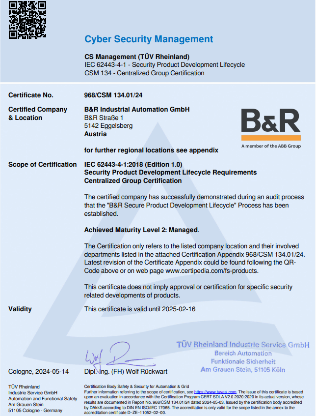

> Tags: #网络安全

- [1 A01.002.如何了解贝加莱产品网络安全的标准](#_1-a01002%E5%A6%82%E4%BD%95%E4%BA%86%E8%A7%A3%E8%B4%9D%E5%8A%A0%E8%8E%B1%E4%BA%A7%E5%93%81%E7%BD%91%E7%BB%9C%E5%AE%89%E5%85%A8%E7%9A%84%E6%A0%87%E5%87%86)
- [2 贝加莱产品网络安全说明](#_2-%E8%B4%9D%E5%8A%A0%E8%8E%B1%E4%BA%A7%E5%93%81%E7%BD%91%E7%BB%9C%E5%AE%89%E5%85%A8%E8%AF%B4%E6%98%8E)
- [3 贝加莱通过IEC 62443-4-1认证](#_3-%E8%B4%9D%E5%8A%A0%E8%8E%B1%E9%80%9A%E8%BF%87iec-62443-4-1%E8%AE%A4%E8%AF%81)
- [4 反馈发现的安全问题](#_4-%E5%8F%8D%E9%A6%88%E5%8F%91%E7%8E%B0%E7%9A%84%E5%AE%89%E5%85%A8%E9%97%AE%E9%A2%98)

# 1 A01.002.如何了解贝加莱产品网络安全的标准

- 点击贝加莱官方链接 [Cyber Security | B&R Industrial Automation (br-automation.com)](https://www.br-automation.com/en/service/cyber-security/) 链接，即可查询网络安全标准以及相关的最新动态。

# 2 贝加莱产品网络安全说明

- [点击跳转访问PDF → Cyber_Security_Defense_in_Depth_for_BR_Products-bdd37e82.pdf (br-automation.com)](https://www.br-automation.com/fileadmin/Cyber_Security_-_Defense_in_Depth_for_BR_Products-bdd37e82.pdf)

# 3 贝加莱通过IEC 62443-4-1认证

- [TUV_Certificate_62443-4-1_Q1_23-bc47b14e.pdf (br-automation.com)](https://www.br-automation.com/fileadmin/TUV_Certificate_62443-4-1_Q1_23-bc47b14e.pdf)
- [TUV_Certificate_Appendix_62443-4-1_Q1_23-ec06ea3a.pdf (br-automation.com)](https://www.br-automation.com/fileadmin/TUV_Certificate_Appendix_62443-4-1_Q1_23-ec06ea3a.pdf)
- 

# 4 反馈发现的安全问题

- 在网站上，可以点击Email来发送邮件反馈使用时发现的任何安全问题
    - 
- 或者联系ICS-CERT https://www.kb.cert.org/vuls/report
