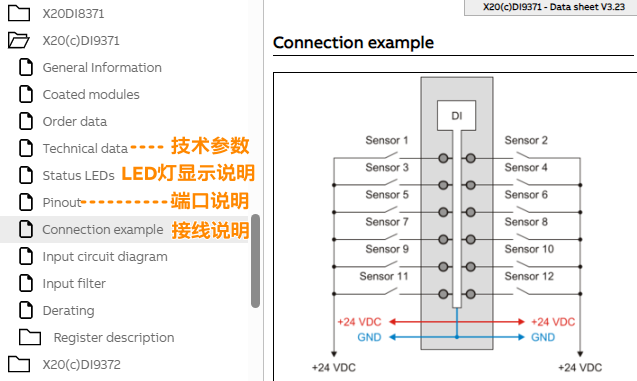

> Tags: #安装与接线

- [1 A01.003.如何查看贝加莱X20系列模块的接线图](#_1-a01003%E5%A6%82%E4%BD%95%E6%9F%A5%E7%9C%8B%E8%B4%9D%E5%8A%A0%E8%8E%B1x20%E7%B3%BB%E5%88%97%E6%A8%A1%E5%9D%97%E7%9A%84%E6%8E%A5%E7%BA%BF%E5%9B%BE)
- [2 方式一：访问在线帮助网站](#_2-%E6%96%B9%E5%BC%8F%E4%B8%80%EF%BC%9A%E8%AE%BF%E9%97%AE%E5%9C%A8%E7%BA%BF%E5%B8%AE%E5%8A%A9%E7%BD%91%E7%AB%99)
- [3 方式二：本地化CHM下载使用](#_3-%E6%96%B9%E5%BC%8F%E4%BA%8C%EF%BC%9A%E6%9C%AC%E5%9C%B0%E5%8C%96chm%E4%B8%8B%E8%BD%BD%E4%BD%BF%E7%94%A8)

# 1 A01.003.如何查看贝加莱X20系列模块的接线图

# 2 方式一：访问在线帮助网站

- 访问贝加莱英文的在线帮助，可在此处查看到完整的接线说明
    - [B&R Online Help (br-automation.com)](https://help.br-automation.com/#/en/4/hardware%2Fx20_module%2Fdatenblatter.html)
- 例如X20DI9371模块
    - [B&R Online Help (br-automation.com)](https://help.br-automation.com/#/en/4/hardware%2Fx20di9371%2Fanschlussbeispiel.html)
    - 

# 3 方式二：本地化CHM下载使用

- 在以下chm文件中搜索相应模块型号即可，模块的页面包含了常用模块基本信息以及详细的接线图。
- 下载链接如下： https://pan.baidu.com/s/1x-plNxROA-jqoAjCjxGzeg 提取码： qsh3
