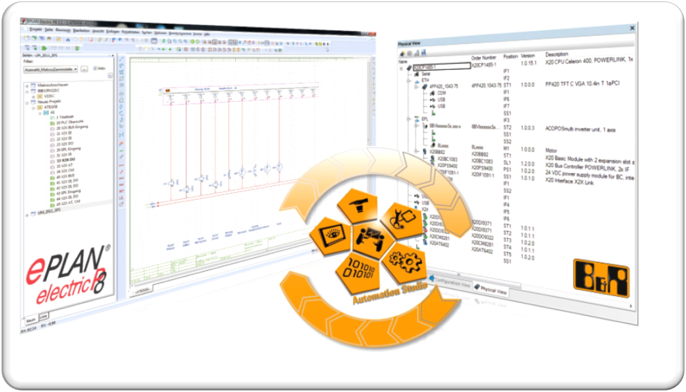
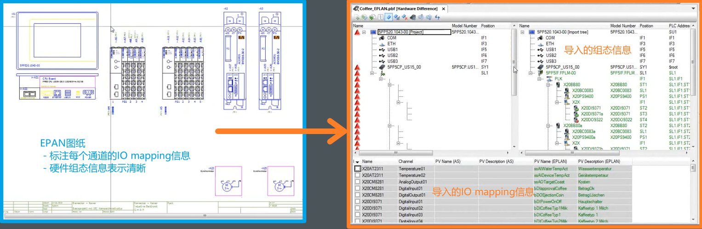

> Tags: #EPLAN #图纸

- [1 如何获取贝加莱硬件产品EPLAN图纸文件？](#1%20%E5%A6%82%E4%BD%95%E8%8E%B7%E5%8F%96%E8%B4%9D%E5%8A%A0%E8%8E%B1%E7%A1%AC%E4%BB%B6%E4%BA%A7%E5%93%81EPLAN%E5%9B%BE%E7%BA%B8%E6%96%87%E4%BB%B6%EF%BC%9F)
- [2 EPLAN电气原理图与贝加莱Automation Studio如何配合](#2%20EPLAN%E7%94%B5%E6%B0%94%E5%8E%9F%E7%90%86%E5%9B%BE%E4%B8%8E%E8%B4%9D%E5%8A%A0%E8%8E%B1Automation%20Studio%E5%A6%82%E4%BD%95%E9%85%8D%E5%90%88)
- [3 如何在EPLAN中导入并使用贝加莱硬件相关宏文件](#3%20%E5%A6%82%E4%BD%95%E5%9C%A8EPLAN%E4%B8%AD%E5%AF%BC%E5%85%A5%E5%B9%B6%E4%BD%BF%E7%94%A8%E8%B4%9D%E5%8A%A0%E8%8E%B1%E7%A1%AC%E4%BB%B6%E7%9B%B8%E5%85%B3%E5%AE%8F%E6%96%87%E4%BB%B6)
	- [3.1 下载并安装EPLAN文件](#3.1%20%E4%B8%8B%E8%BD%BD%E5%B9%B6%E5%AE%89%E8%A3%85EPLAN%E6%96%87%E4%BB%B6)
	- [3.2 安装宏（.zw5 文件）](#3.2%20%E5%AE%89%E8%A3%85%E5%AE%8F%EF%BC%88.zw5%20%E6%96%87%E4%BB%B6%EF%BC%89)
	- [3.3 在EPLAN 内导入article data 的 xml 文件](#3.3%20%E5%9C%A8EPLAN%20%E5%86%85%E5%AF%BC%E5%85%A5article%20data%20%E7%9A%84%20xml%20%E6%96%87%E4%BB%B6)
	- [3.4 （若使用老版本的EPLAN安装文件）拷贝 B&R 宏文件至 EPLAN 指定目录](#3.4%20%EF%BC%88%E8%8B%A5%E4%BD%BF%E7%94%A8%E8%80%81%E7%89%88%E6%9C%AC%E7%9A%84EPLAN%E5%AE%89%E8%A3%85%E6%96%87%E4%BB%B6%EF%BC%89%E6%8B%B7%E8%B4%9D%20B&R%20%E5%AE%8F%E6%96%87%E4%BB%B6%E8%87%B3%20EPLAN%20%E6%8C%87%E5%AE%9A%E7%9B%AE%E5%BD%95)
	- [3.5 EPLAN 绘图使用 B&R 宏](#3.5%20EPLAN%20%E7%BB%98%E5%9B%BE%E4%BD%BF%E7%94%A8%20B&R%20%E5%AE%8F)
	- [3.6 总结](#3.6%20%E6%80%BB%E7%BB%93)
- [4 EPLAN使用相关帮助信息](#4%20EPLAN%E4%BD%BF%E7%94%A8%E7%9B%B8%E5%85%B3%E5%B8%AE%E5%8A%A9%E4%BF%A1%E6%81%AF)
- [5 更新日志](#5%20%E6%9B%B4%E6%96%B0%E6%97%A5%E5%BF%97)

# 1 如何获取贝加莱硬件产品EPLAN图纸文件？

- 访问贝加莱官网网站， www.br-automation.com
- 在搜索框中输入 `EPLAN` 加上想搜索的产品型号
    - 例如 `EPLAN ACOPOSmulti`
    - 
- 即可看到对应产品的EPLAN文件信息，下载exe文件本地安装即可
    - 
    - [ACOPOSmulti EPLAN P8 from V2.4 | B&R Industrial Automation (br-automation.com)](https://www.br-automation.com/zh/downloads/motion-control/drive-systems/acoposmulti/acoposmulti-eplan-p8-from-v24/?noredirect=1)

# 2 EPLAN电气原理图与贝加莱Automation Studio如何配合

- 使用EPLAN Electric P8 (>V2.4) 与 Automation Studio 4.4版本，EPLAN电气原理图与贝加莱硬件配置能够实现互相转换。
    - 在 EPLAN 中导出和导入 B&R PLC 数据
    - 在EPLAN 中进行总线配置（BUS Configuration）
    - 导出和导入I/O通道的过程变量
    - 
    - 
    - 
    - 

# 3 如何在EPLAN中导入并使用贝加莱硬件相关宏文件

> 🔴 以下操作方式的所使用版本较老，仅供参考

## 3.1 下载并安装EPLAN文件

- 下载并安装贝加莱官网上获取的EPLAN文件，例如 BuR_ACOPOSmulti_EPLAN_Data.exe
    - 
    - 安装时注意选择安装的路径
    - 
    - 安装完成后，可在安装文件夹中查看dxf文件以及⭐Documentation中的说明文件
    - 

## 3.2 安装宏（.zw5 文件）

> 🔴老版本的EPLAN安装文件中没有此文件，请参考3.4章节手动拷贝

- 双击所需的 .zw5 文件，打开 EPLAN P8 和对话框 "还原宏"。
- .zw5文件在上一节安装路径中的 `EPLAN Data\Macros` 文件夹中
- 
- 选择目标目录后，宏即可在 EPLAN 中使用。
- 如果已经安装了该产品组的某个版本，则必须通过 EPLAN 查询后替换所有数据。
    - 

## 3.3 在EPLAN 内导入article data 的 xml 文件

- 文档数据（article data）必须直接安装在 EPLAN 中
- A、打开(或新建)一个工程：
    - 菜单栏 `工具\部件\管理（Utilities / Articles / Administration.）` 点击 `附加\导入（Tools / Import）` 选择下载安装后在 `EPLAN Data\ACOPOSmulti\` 文件夹下的 Articledata.xml 文件）
    - 
    - 
    - 点击确定，进行 xml 文件的导入。
- B、成功导入后可看到 PLC 内数据如下：(在 PLC 下可以看到 B&R 的 X20 产品信息)
    - 

## 3.4 （若使用老版本的EPLAN安装文件）拷贝 B&R 宏文件至 EPLAN 指定目录

- A、需要拷贝下载的 B&R 宏文件内的宏、图片如下
    - 
- B、EPLAN 下查看文件拷贝路径方式如下：
    - 在菜单栏里选项 `\设置\用户\管理\目录` 查看宏文件存储位置目录、图片存储位置目录。
    - 

## 3.5 EPLAN 绘图使用 B&R 宏

- 绘图使用，菜单栏，插入窗口宏
- 

## 3.6 总结

- 本示例主要以 X20 模块使用作参考，B&R 其他产品在 EPLAN 下使用(如 ACOPOSmulti)。
- 使用中注意 EPLAN 的版本。
- 主要步骤为：
    - 1、 下载 B&R 产品对应 EPLAN 宏文件，保存至本地电脑
    - 2、 在 EPLAN 内导入 xml 文件
    - 3、 拷贝下载的 Macros 文件、 Images 文件至 EPLAN 指定的目录下
    - 4、 绘图使用窗口宏

# 4 EPLAN使用相关帮助信息

- Automation Help中可从以下条目中查看到相关信息 Project management → Hardware management → ECAD import/export
    - 
- 🌐在线访问链接
    - [B&R Online Help (br-automation.com)](https://help.br-automation.com/#/en/4/projectmanagement%2Fecad_importexport%2Fintro%2Fecad_intro.html)
    - 

# 5 更新日志

| 日期     | 修改人     | 修改内容     |
|:-----|:-----|:-----|
| 2024-02-19     | YuanZhiyi     | 初次创建     |
