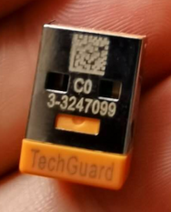

# 008硬件狗可以存储数据吗

- 一般只用于授权License验证
- 可以使用AsGuard库的guardWriteData函数，将任何数据（最多 241 字节）写入 B&R 加密狗上的存储区。 在重新启动或 PLC 崩溃以及移除加密狗后，该数据仍保留在 B&R 加密狗上。 该功能块使一种 CPU 数据记录器（类似于飞机上的黑匣子）成为可能，它允许存储重要数据，以便在发生极端情况下进行数据收集。