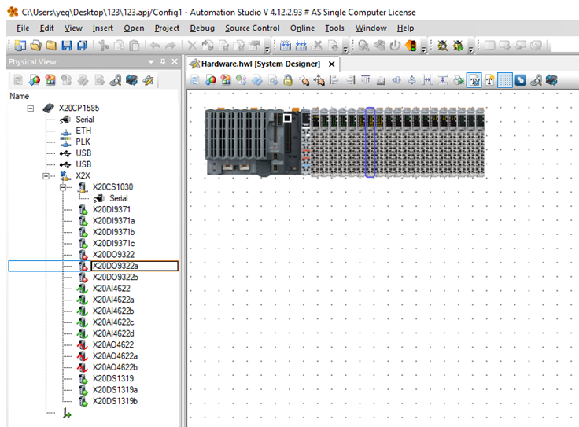

# 012 供电计算使用 AS 自动计算供电 PS 模块安装位置
## 问题描述

- 在为客户配置IO模块的时候，我们需要计算模块消耗的总功率。如果X2X总线上能提供的最大功率不能满足使用要求，则应该添加PS辅助电源模块。
- 曾经我们依靠手动计算来确认PS模块的安装数量和位置。而在AS更新到**4.12**版本之后，我们可以依靠AS自带的功能来帮助我们完成这一步骤，方便又省时。接下来我们来一起看一看如何操作吧！

## 解决方案

- 第一步：首先我们需要安装 AS4.12版本。
    - 官网上下载，则可以使用如下链接：
    - [Automation Studio V4.12 | B&R Industrial Automation (br-automation.com)](https://www.br-automation.com/zh/downloads/software/automation-studio/automation-studio-412/automation-studio-v412/)
- 第二步：安装完毕后，先搭建硬件组态：
    - 
- 第三步：然后点击下图 Analyze Hardware Configuration 按钮：
    - 
    - AS 会开始计算。如果出现需要添加 PS 模块的情况，则会出现报错：
- 第四步：检查输出结果
    - 
    - 报错信息中会显示需要添加 PS 模块的位置。

> 如果想了解关于功率计算的详细内容，可以查看 AS Help - Hardware-X20 system - Mechanical and electrical configuration - Calculating the power requirements