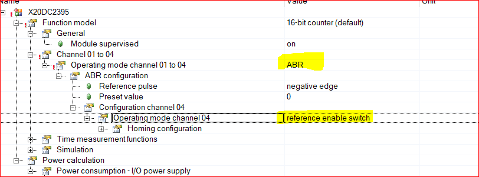
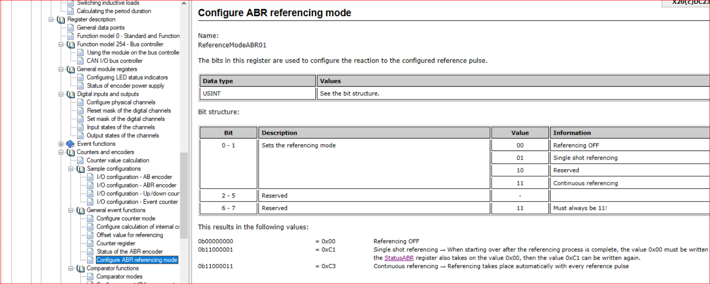
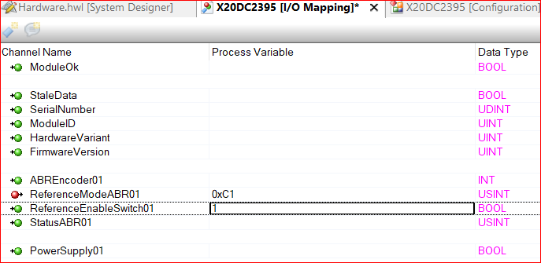

# 013模块X20DC2395的使用基本技巧
## 如何在程序中将Counter01的值重置为0？
## 该模块需要配置成ABR编码器接收时才可以使用Reset功能，而在计数和A/B编码器是没有Reset功能，在该种模式下可以通过软件上进行归零，即通过中间变量转换实现。

## ABR编码器用编码器的R信号进行归零：第四通道的输入作为归零使能，同时模式 ReferencingModeABR01 要设置0xC1（一次归零） 或0xC3（碰到R信号就归零）。通过这样设置模块的第四通道使能，碰到R信号 编码器的值就归零。
