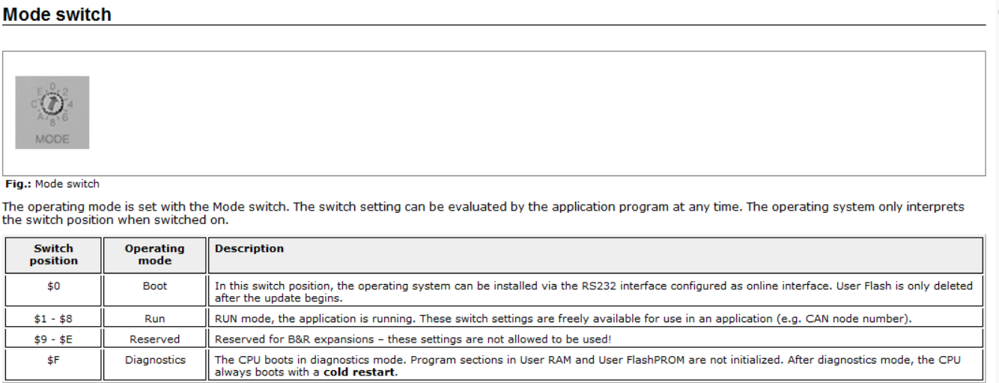

# 问题描述

7cp470.60-2，这个模块上电后无法通过串口和调试电脑通信，一直显示offline

# 解决方法

1. 将 CP470的拨码拨到0，使 CP470进入 BOOT 模式

2. 打开Automation Studio，找到Transfer Automation Runtime选项，将AR系统下载至CP470

3. 下载完成后，将拨码驳回1-8中任意一格，使CP470重新进入RUN模式

4. 在Automation Studio中搜索设备并进行连接，连接完成后进行在线下载程序即可

最后，请确保电脑实际串口和AS中设置一致；
