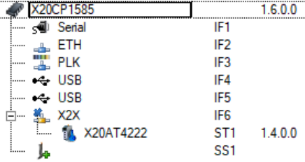
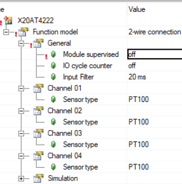
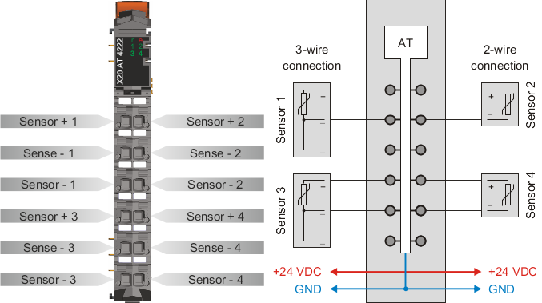
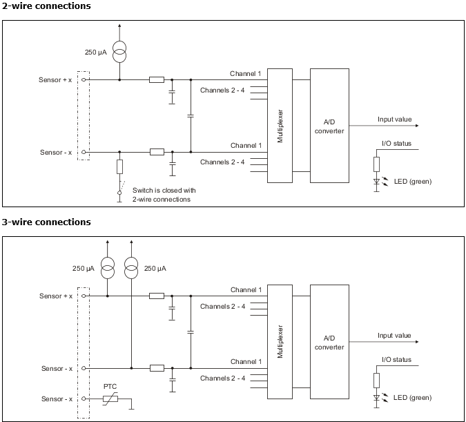
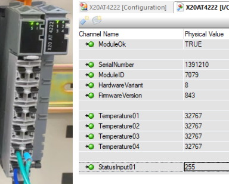
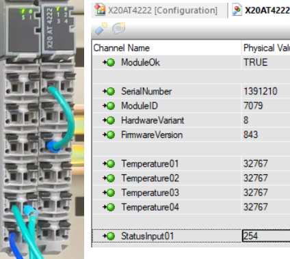
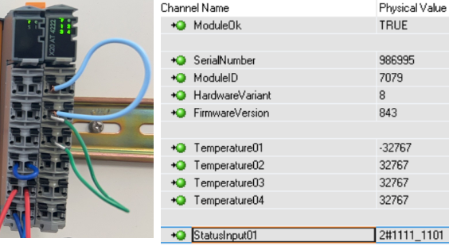

# 结论

|状态 |通道监测值|   StatusInput 01   |
|:-----|:-----|:-----|
|开路|32767|255|
|短路 |-32767|253|

# 测试信息

- 
- 模块配置信息
    - 

# 模块说明

- 硬件模块接线法方式说明
    - 
- 接线图：二线制/三线制
    - 

# 测试信息

IoMapping：通道状态为255，为开路状态

状态为254，显示通道报的是超过上限

通道1数值为-32767；StatusInput01状态为253，显示通道1数值低于下限
