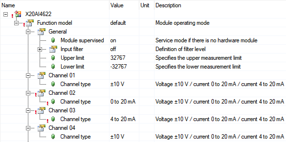

# 简介

- 该模块配备了4个输入，具有13位(包括符号)数字转换器分辨率。可以使用不同的端子在电流和电压信号之间进行选择。
    - 4个模拟输入
    - 电流或电压信号均可
    - 13 位数字转换器分辨率
- 

# 基本设置

- 通过配置，四个通道均可独立设置为 `±10V`，`0-20mA`，`4-20mA` 三种模式
- 

## 不同配置下未接线数值

|模式 |数值 |
|:-----|:-----|
|±10V |32767|
|0-20mA |0|
|4-20mA |-8192|

# 各种配置下数值信号

|模式|最小值 |最大值|
|:-----|:-----|:-----|
|±10V|-10V : -32767 |+10V : +32767|
|0-20mA|0mA : 0|20mA : +32767|
|4-20mA|4mA : 0|20mA : +32767|
