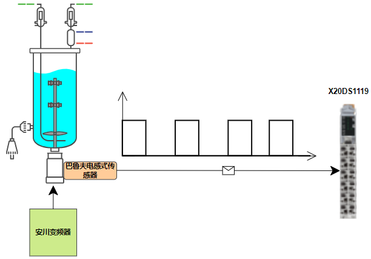
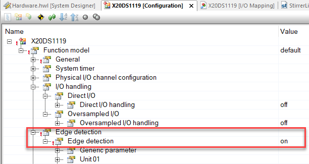
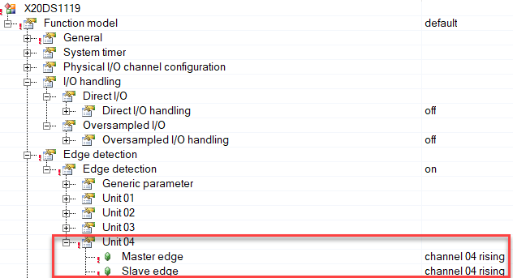
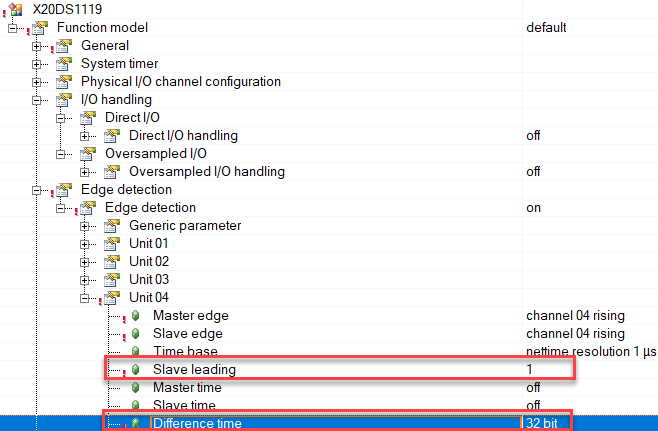
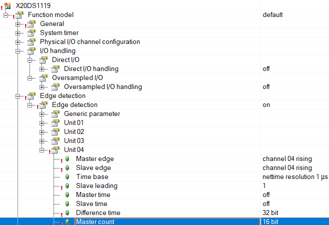
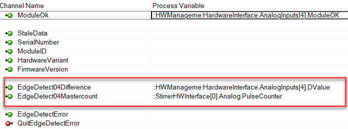

首次使用 X20DS1119 时，您可能会因为所有配置的丰富可能性而有些迷茫。

此用例向您展示了一种使用它来计算使用单通道 TTL 信号的电机速度的方法。

# 描述

客户拥有由安川驱动器驱动的第三方异步电机，该设定值通过模拟输出模块驱动。由于需要调节速度，因此需要进行速度测量。为此，客户使用了 BALLUF 的电感式传感器。该传感器输出 TTL 24V 信号，分辨率为**4脉冲/转。**



<span style="background:#A0CCF6">1.</span>在 X20DS1119 模块的 AS 配置上激活边缘检测



<span style="background:#A0CCF6">2.</span>目标是获得模块通道04上的**最后一个脉冲持续时间**。因此，我们需要一个主边和一个从边来计算**边之间的时间差**



<span style="background:#A0CCF6">3.</span>这将始终给出 0 作为时差，因为主脉冲和边的最后一个脉冲的时间戳相同。模块内部提供了一个 FIFO 缓冲器，该缓冲器始终存储最后256个从站戳，并且**设置为 slave leading 为1**，检索从站最后第二个时间戳，结果使用最后一个脉冲持续时间的时间差。



<span style="background:#A0CCF6">4.</span>除此之外，我们还需要计算边的数量，以便稍后知道我们是否处于静止状态（值不随时间变化）。



<span style="background:#A0CCF6">5.</span>然后，模块的 IO 映射将提供计算电机速度所需的 2 个信息
    a.最后脉冲持续时间：**EdgeDectect04Difference** （μs）

    b.sigal上升沿数量：**EdgeDectect04Mastercount**



<span style="background:#A0CCF6">6.</span>在软件代码部分，每秒计算脉冲计数器差并处理溢出

```c
CASE Internal.State OF
    WAIT_UPDATE_PULSE_COUNTER:
        Internal.timerCheckPulseCounterDiff.PT := T#1s;
        Internal.timerCheckPulseCounterDiff.IN:= TRUE;
        
        IF Internal.timerCheckPulseCounterDiff.Q THEN
            Internal.timerCheckPulseCounterDiff.IN:= FALSE;
            Internal.State := UPDATE_PULSE_COUNTER;
        END_IF;

    UPDATE_PULSE_COUNTER:
        ///////////////////////////////////////////////////////////////
        // Update pulse counter diff and handle overflow
        //////////////////////////////////////////////////////////////

        IF (HWInterface.PulseCounter >= Internal.LastPulseCounter) THEN
            // in range
            Internal.PulseCounterDiff := HWInterface.PulseCounter - Internal.LastPulseCounter;
        ELSIF (HWInterface.PulseCounter < Internal.LastPulseCounter) THEN
            // overflow
            Internal.PulseCounterDiff :=  (32767-Internal.LastPulseCounter) + (UDINT_TO_INT(32768)-(ABS(HWInterface.PulseCounter)));
        END_IF

        Internal.LastPulseCounter := HWInterface.PulseCounter;
        Internal.State := WAIT_UPDATE_PULSE_COUNTER;

END_CASE;

Internal.timerCheckPulseCounterDiff();
```

<span style="background:#A0CCF6">7.</span>由于最后一个脉冲持续时间的值在相同的速度下有一些变化，因此我们将值存储在缓冲区（长度为 24）中，并计算同一缓冲区中值的平均值，以及脉冲周期和频率

```c
///////////////////////////////////////////////////////////////
// Calculate actual speed based on last recorded pulse duration
//////////////////////////////////////////////////////////////

Internal.fbCalcAvg.pDest := ADR(Internal.BufferPeriod);
Internal.fbCalcAvg.DataLength := SIZEOF(Internal.BufferPeriod);
Internal.fbCalcAvg.Value := ABS(HWInterface.Value);

IF (Internal.PulseCounterDiff<>0) THEN
    Internal.fbCalcAvg();  // calculate average values
    Internal.LastPeriodeTime_s := DINT_TO_REAL(ABS(Internal.fbCalcAvg.AverageValue)) / 1000000.0;
    Internal.PulsPerSec := 1/Internal.LastPeriodeTime_s;
ELSE
    Internal.PulsPerSec := 0.0;
END_IF;

```

<span style="background:#A0CCF6">8.</span>最后，我们可以计算转速（PulsePerRev 是一个常数：4）

```c
Internal.PulsePerMin := Internal.PulsPerSec * 60.0;
Internal.ActSpeed := Internal.PulsePerMin / (HWInterface.PulsePerRev * HWInterface.GearBoxRatio);
``` 
