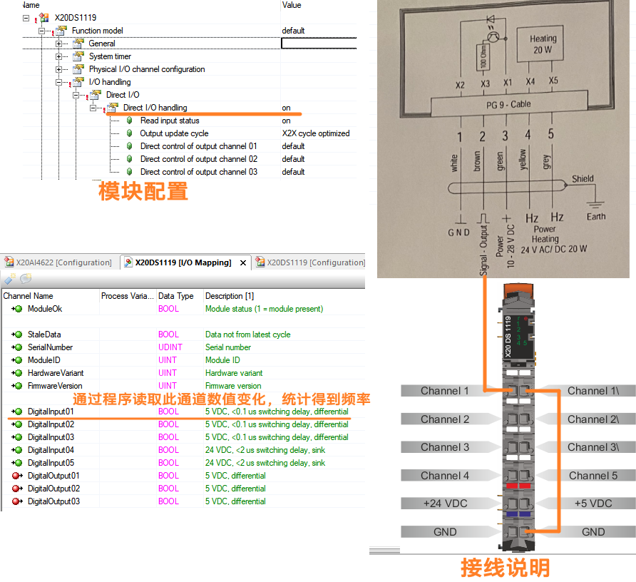

# 需求

- 需读取一线制 5 V 的脉冲信号，信号频率为 2 Hz ~ 573 Hz
- 因只有 `X20DS1119` 模块，故需用此模块进行数值读取 5 V 信号

# 实现思路

- 由于信号非常低频且变化缓慢，因此用不上 `X20DS1119` 模块的 Counter 功能与 Edge Detection 功能
- 仅需以普通 DI 信号的方式进行数据读取，PLC 以 1 ms 的任务周期检测通道 BOOL 值是否有变化，配合程序计算频率。

# 配置与接线方式

