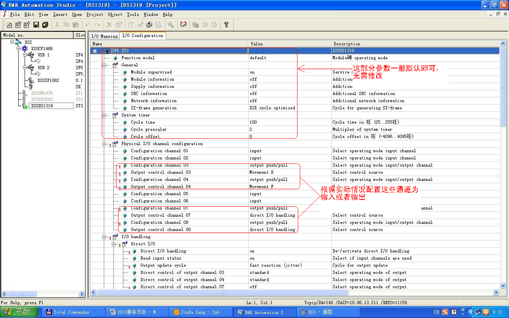
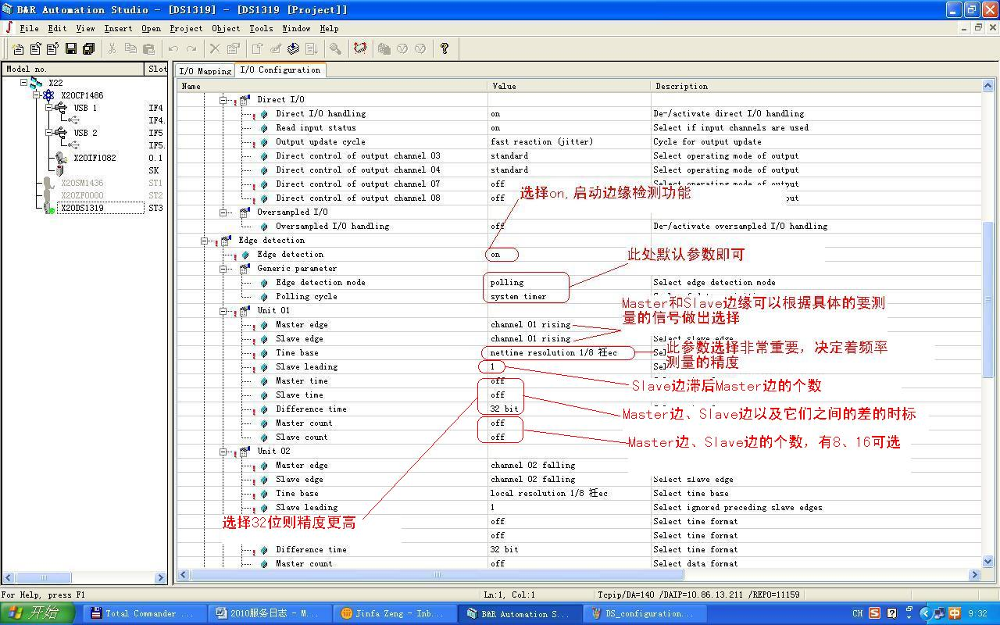
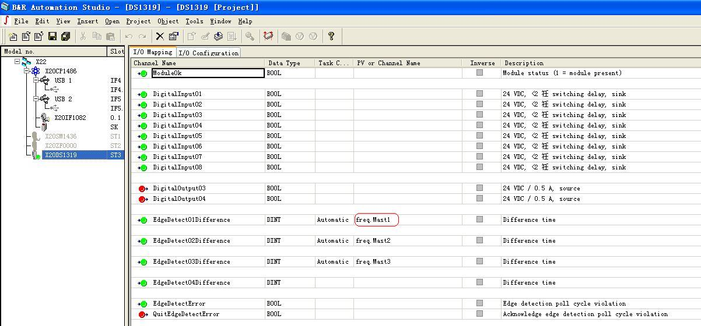
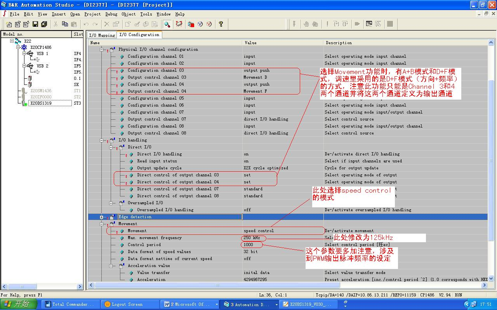
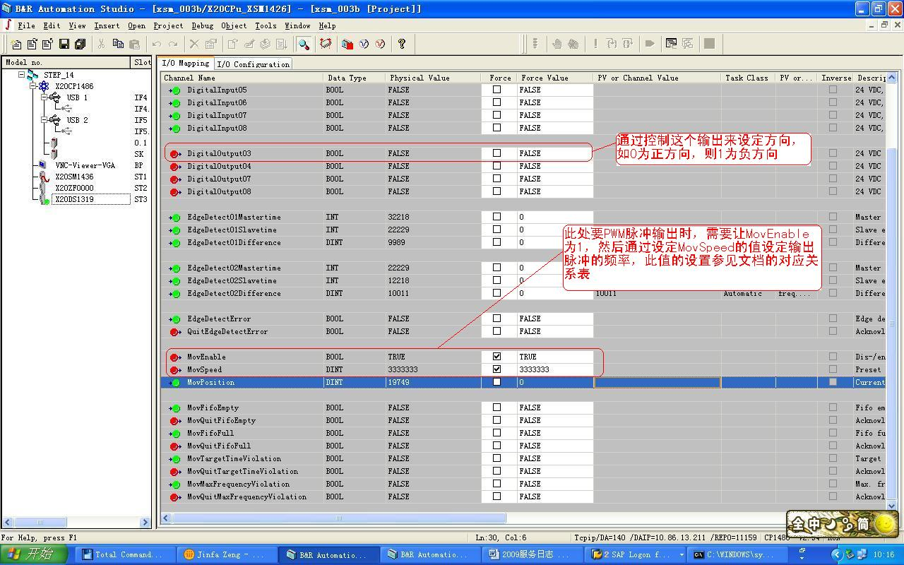
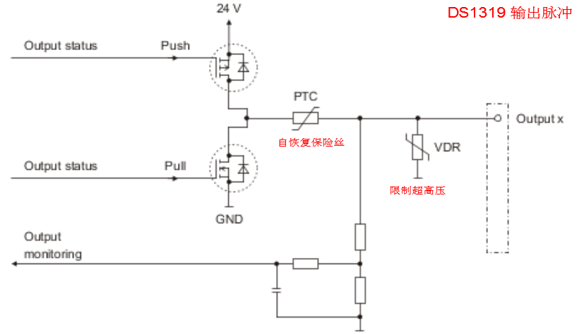
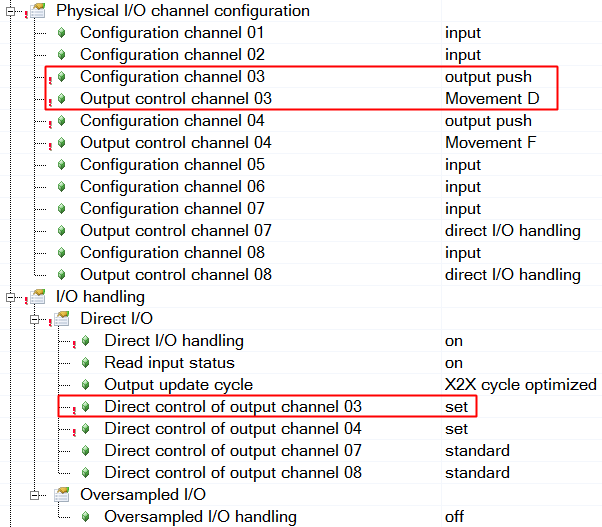
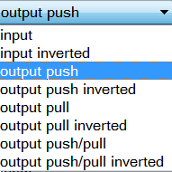
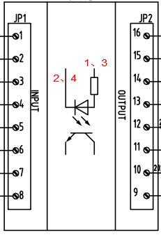

- [1.模块基本功能](#1.%E6%A8%A1%E5%9D%97%E5%9F%BA%E6%9C%AC%E5%8A%9F%E8%83%BD)
- [2.频率测量](#2.%E9%A2%91%E7%8E%87%E6%B5%8B%E9%87%8F)
	- [2.1基本参数配置](#2.1%E5%9F%BA%E6%9C%AC%E5%8F%82%E6%95%B0%E9%85%8D%E7%BD%AE)
	- [2.2边缘检测](#2.2%E8%BE%B9%E7%BC%98%E6%A3%80%E6%B5%8B)
	- [2.3频率计算](#2.3%E9%A2%91%E7%8E%87%E8%AE%A1%E7%AE%97)
- [3.PWM脉冲输出](#3.PWM%E8%84%89%E5%86%B2%E8%BE%93%E5%87%BA)
	- [3.1外部接线](#3.1%E5%A4%96%E9%83%A8%E6%8E%A5%E7%BA%BF)
	- [3.2驱动光隔线圈](#3.2%E9%A9%B1%E5%8A%A8%E5%85%89%E9%9A%94%E7%BA%BF%E5%9C%88)
- [4.两种测频方式](#4.%E4%B8%A4%E7%A7%8D%E6%B5%8B%E9%A2%91%E6%96%B9%E5%BC%8F)

# 1.模块基本功能

DS1319是一个功能强大配置复杂的特殊模块，具有4通道可配置输入/输出、事件计数器、编码器、线性位置发生器、SSI编码器以及边缘检测等功能。注意，DS1319的边缘检测功能需要升级AS和硬件firmware到较高版本，否则在硬件树上可能无法添加此模块或者添加后找不到边缘检测的功能，出现这种情况最好在线升级一下。

# 2.频率测量

DS1319可以运用在水电调速行业的频率测量和相位差测量，其原理是利用DS1319的边缘检测（Edge detection）功能及上升沿或下降沿的检测功能。一个DS1319具有多达4路边缘检测功能，这个不是和输入通道完全锁定的，即输入信号只能是四路，具体看下面的解释。

边缘检测功能可以检测输入型号的上升沿或者下降沿出现时的时标（时间计数值）以及边缘信号之间的时间差。对于边缘检测功能来说，一般定义一路信号为Master边缘信号，一路信号为Slave边缘信号，而Master和Slave边缘信号既可以是同一路信号的上升沿或者下降沿也可以是不同信号的上升沿或者下降沿，它们是数学上的组合的关系，在IO Configuration里面可以组合选择。

下面根据AS详细介绍该模块的配置和使用。

## 2.1基本参数配置

如上图所示，基本参数基本按默认参数即可，在对参数具体意义不是非常清楚的情况下，不要随意修改这些参数。

## 2.2边缘检测

边缘检测功能部分的配置如下图示。

如想测试Channel 1 信号的频率，就可以按照下图的配置，把Channel 1的上升沿同时配置为Master Edge和Slave Edge，由于Master Edge和Slave Edge是取自同一信号，如果此时设置Slave leading为0，则Master Edge和Slave Edge的差值（Difference time）应该为0，这样就无法检测，而设置Slave leading为1，即Slave Edge要滞后Master Edge一个周期，而此时Master Edge和Slave Edge的差值刚好就是一个周期时间，而这就是我们需要的。当然，在你熟悉这个工作机理后，还有多种配置方式可以实现同样的目的。如设置Slave leading为2，则Master Edge和Slave Edge的差值除以2也同样是一个周期的时间。

## 2.3频率计算

通过上面的配置，我们在IO mapping里面就可以看到下面的变量，如EdgeDetect01Difference，如果我们把它赋给定义的变量freq.Mast1，然后我们在程序里面只要编写下面的一行程序就可以得出Channel 1的频率结果。

**Freq = 1 / ( REAL ( ABS ( freq.Mast1 ) ) / 8000000 )**

**注意：** 上面的 ABS 是取绝对值，用不用都可；REAL 是强制转换为浮点型；特别要注意的是，后面的红色的数值不是随便定义的，如果 Time base 选择为“nettime resolution 1/8 usec ” 或者“local resolution 1/8 usec”则红色的数值为 8000000 ；而如果选择为“nettime resolution 1 usec ” 或者“local resolution 1 usec”的话，那么红色部分的值应该修改为1000000而不是8000000了，这个要特别留意。

# 3.PWM脉冲输出

DS1319还可以提供一路D+F（方向+频率）方式的PWM的脉冲输出，这个也是适用于水电调速的需求的。

PWM脉冲输出是通过DS1319的Movement功能来实现的，D+F模式需要把Channel 3和4设置为输出通道，具体设置如下图。

特别要注意的是，在速度控制模式，control period 参数决定了MovSpeed参数（见图5）对应的输出频率。Control period参数的默认值是1000us(可以设置的范围是从50\~5000us)。从下表1中可以看出这种对应关系。

| Control Period参数(单位：us) | 频率值(单位：Hz) (F+D输出模式下) |             |                 |
|------------------------------|----------------------------------|-------------|-----------------|
|                              | MovSpeed=1,000,000时             | 400,000,000 | 2,000,000,000时 |
| 1000                         | 30                               | 12k         | 30k             |
| 100                          | 300                              | 120k        | 125k            |
| 50                           | 600                              | 121k        | 121k            |

在下图可以看到设置后的IO mapping的参数，其中我们需要关注的主要是DigitalOutput03、MovEnable和MovSpeed这三个参数，其它都是辅助的诊断参数。

## 3.1外部接线

  

| push 上拉      | status=1 对外供电                       |
| -------------- | --------------------------------------- |
| pull 下拉      | status=0 电流流入Outputx                |
| push/pull 推挽 | status=1往外供电，status=0 吸收外部电流 |

## 3.2驱动光隔线圈

- 用DS1319的output驱动光隔线圈，光隔触点驱动脉冲伺服
- 用AS配置 output 为 push/pull方式，外部接线：
  - ①1、3接24v+，2、4接ds1319的output，可以，程序里为反逻辑；
  - ②1、3接ds1319的output，2、4接0v（与ds1319共地），可以，正逻辑，注意驱动能力。
- 如果外部电路非24v电压，ds1319用pull方式（sink），将外部信号浮空(不通)/接地(通)。
- push方式相当于source型。

# 4.两种测频方式

- 上面实现的是残压测频，经过互感获得正弦波信号，经整形得到方波信号，进入 DS1319 的 egde detection 通道测量。
- 还有一种是齿盘测频，直接获得方波信号，进入 DS1319 的 egde detection 通道测量，再根据齿盘齿数和发电机磁极对数的比例，放大或缩小测量值得到实际发电频率。
- DS1319和 DS4389都包含4路测频单元，方波信号可以从 channel1 ~ channel8 输入，在软件上与测频单元匹配。
