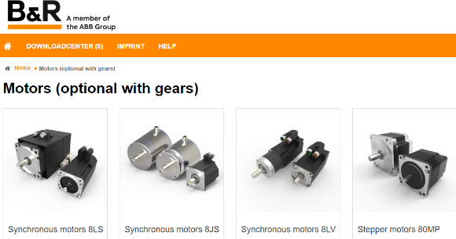
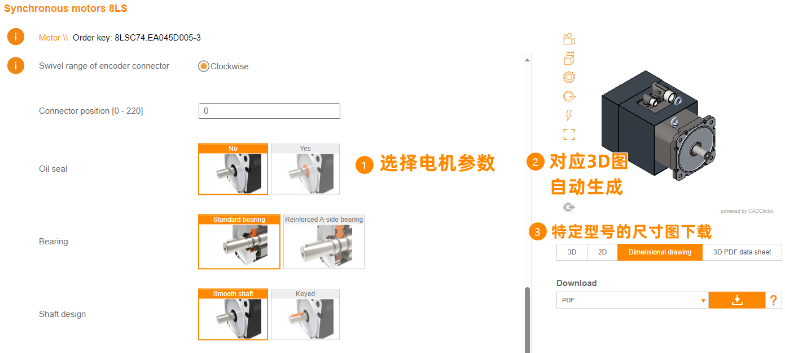
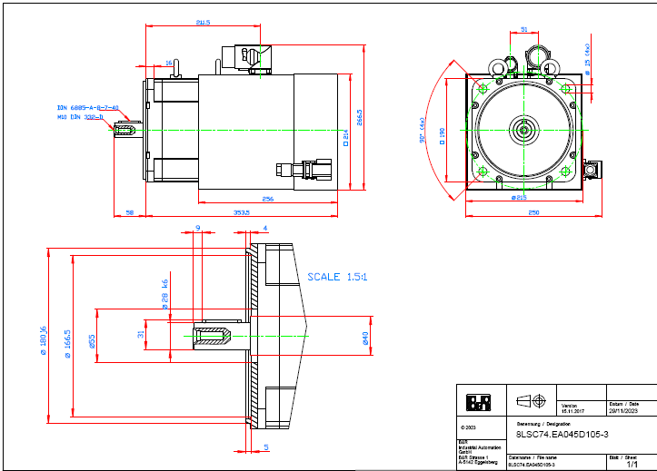

> 001如何获取贝加莱电机的CAD图纸文件？

> #电机 #CAD #选型

- [1 在线访问获取](#1%20%E5%9C%A8%E7%BA%BF%E8%AE%BF%E9%97%AE%E8%8E%B7%E5%8F%96)
- [2 在线选型](#2%20%E5%9C%A8%E7%BA%BF%E9%80%89%E5%9E%8B)
- [3 特定型号三视图下载获取](#3%20%E7%89%B9%E5%AE%9A%E5%9E%8B%E5%8F%B7%E4%B8%89%E8%A7%86%E5%9B%BE%E4%B8%8B%E8%BD%BD%E8%8E%B7%E5%8F%96)

# 1 在线访问获取

- [B&R CAD product catalogue (br-automation.com)](http://cad.br-automation.com/)
- `http://cad.br-automation.com/`

# 2 在线选型

- 
- 

# 3 特定型号三视图下载获取

- 
