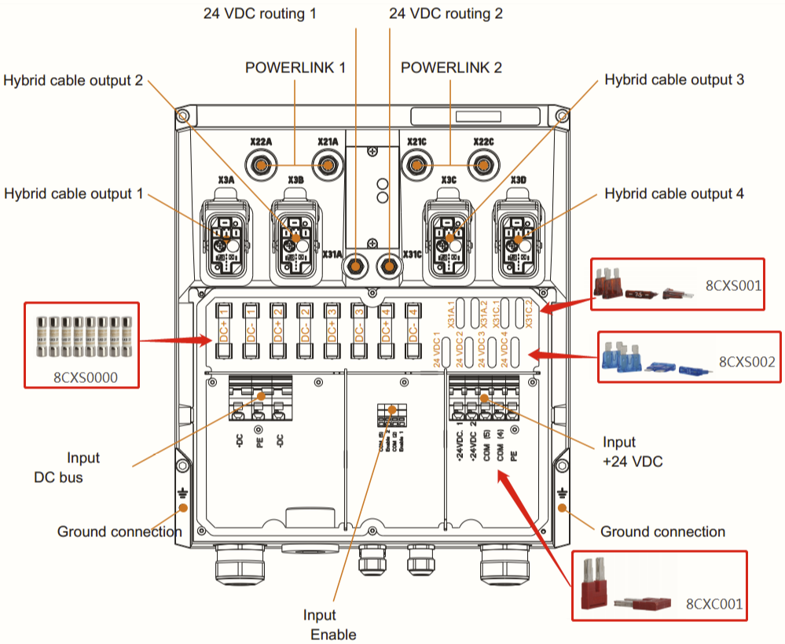

# 005关于8CVE在ACOPOSmulti65系统中的使用

## 8CVE模块的作用
- 在ACOPOSmulti65驱动系统中通常使用混合电缆（8CCH）进行与逆变或电机之间的连接。此时，8CVE连接盒就符合现场组态的需求。
    - 8CVE连接盒包含：4组混合电缆接头、2组POWERLINK接口、2组24 VDC接口；
    - 8CVE整机符合IP65防护等级（ EN 60529 protection）
- 常规组态，可参照下图，Help ID:86ce856e-47af-4614-92da-a8151c1554a9；
- 

## 在ACOPOSmulti65驱动系统中8CVE模块是强制性配置吗？
- 8CVE并非是强制性选择，8CVI或8DI模块可以直接通过混合电缆（8CCH000x.11120-1）与8BVE进行连接，组态可参考下图：
- 

## 8CVE模块中8CXC001,8CXS0000,8CXS001,8CXS002的安装位置？
- 
