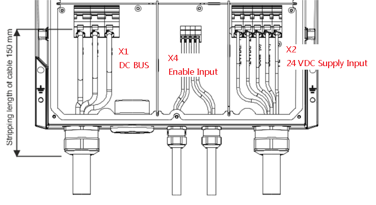
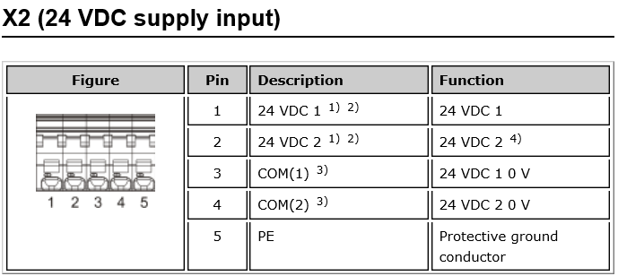

8CVE 选型配置的简单说明

# Table of Contents
- [1 Decentralized Motion Control分布式运动控制](#decentralized-motion-control分布式运动控制)
- [2 8CVE的由来](#8cve的由来)
    - [3 8CVE及其必需附件的订货](#8cve及其必需附件的订货)
    - [3.1 8CVE28000HC00.00-1](#8cve28000hc0000-1)
    - [3.2 必选项： RJ45 to M12 的POWERLINK网线](#必选项-rj45-to-m12-的powerlink网线)
    - [3.3 几乎为必选项： M12 to M12 的POWERLINK网线](#几乎为必选项-m12-to-m12-的powerlink网线)
    - [3.4 必选项：Fuse保险丝](#必选项fuse保险丝)
    - [3.5 可选项](#可选项)
- [4 8CVE内部及保险丝对应的回路](#8cve内部及保险丝对应的回路)
- [5 安装](#安装)
    - [5.1 设定POWERLINK站点拨码](#设定powerlink站点拨码)
    - [5.2 CVE的本体安装](#cve的本体安装)
    - [5.3 CVE的盖板](#cve的盖板)
    - [5.4 CVE的内部接线](#cve的内部接线)
    - [5.5 CVE的外部接线](#cve的外部接线)
    - [5.6 CVE的内部电气图](#cve的内部电气图)
- [6 疑点](#疑点)
    - [6.1 Enable使能端子的额定电流](#enable使能端子的额定电流)

# Decentralized Motion Control分布式运动控制
主要分为两大类ACOPOSremote 8CVI和ACOPOSmotor 8DI。

 

# 8CVE的由来

ACOPOSremote或ACOPOSmotor通常使用混合电缆连接，可以很容易地将各个模块排列成直线结构。以这种方式使用混合电缆的要求是很多的。除了供电和处理网络通信这些主要任务之外，还需要考虑其它方面如连接器技术，可管理性和弯曲半径。这些要求的总和导致一个合理的最大电缆直径，但它最终会受到提供给这条直线结构中ACOPOSremote 8CVI或ACOPOSmotor 8DI逆变器的最大电流的限制。

在该最大电流不够的应用中，必须通过另一种方式提供必要的功率，使其达到现场中的远程位置并在那里重新分配。正是针对这些情况开发了8CVE远程接线盒。

# 8CVE及其必需附件的订货

## 8CVE28000HC00.00-1

8CVE28000HC00.00-1

ACOPOSremote/ACOPOSmotor connection box, HV, IP65, cold plate mounting, 4x connections for hybrid cables, 2x 24 VDC Out

## 必选项： RJ45 to M12 的POWERLINK网线

**用于CVE和PLC的POWERLINK连接。**

**X67CA0E41.0050 5m**

**X67CA0E41.0150 15m**

**还有其他长度的规格，需要在销售系统上查询。**

## 几乎为必选项： M12 to M12 的POWERLINK网线

**当使用**CVE上的X3A X3B X3C X3D中4个超过2个接口则需要选配上。

**用于CVE的X21A和X22A，X21C和X22C这A和C两个HUB之间的POWERLINK连接。**

**X67CA0E61.0020 2m**

**X67CA0E61.0050 5m**

**X67CA0E61.0100 10m**

**X67CA0E61.0150 15m**

**还有其他长度的规格，需要在销售系统上查询。**

## 必选项：Fuse保险丝

| **Product ID**             | **8CXS000.0000-00**                                                                                                                                                                                |
|----------------------------|----------------------------------------------------------------------------------------------------------------------------------------------------------------------------------------------------|
| General information        |                                                                                                                                                                                                    |
| Short description          | Fuse set for 8CVE connection box: 8x fuses for hybrid cable outputs, DC+ and DC-  Type: Blow-out fuse conforming to UL/CSA, Ø 10 x 38 mm Rated current: 20 A Tripping characteristic: Fast-acting  |
| Certification              |                                                                                                                                                                                                    |
| CE                         | Yes                                                                                                                                                                                                |
| Mechanical characteristics |                                                                                                                                                                                                    |
| Weight                     | 68 g                                                                                                                                                                                               |

| **Product ID**             | **8CXS001.​0000-00**                                                                                                                                             | **8CXS001.​0002-00**                                                                                                                                              | **8CXS001.​0005-00**                                                                                                                                              | **8CXS001.​000A-00**                                                                                                                                               |
|----------------------------|-----------------------------------------------------------------------------------------------------------------------------------------------------------------|------------------------------------------------------------------------------------------------------------------------------------------------------------------|------------------------------------------------------------------------------------------------------------------------------------------------------------------|-------------------------------------------------------------------------------------------------------------------------------------------------------------------|
| General information        |                                                                                                                                                                 |                                                                                                                                                                  |                                                                                                                                                                  |                                                                                                                                                                   |
| Short description          | Fuse set for 8CVE connection box: 4 fuses for 24 VDC outputs  Type: Blade fuses conforming to UL/CSA Rated current: 7.5 A Tripping characteristic: Fast-acting  | Fuse set for 8CVE connection box: 20 fuses for 24 VDC outputs  Type: Blade fuses conforming to UL/CSA Rated current: 7.5 A Tripping characteristic: Fast-acting  | Fuse set for 8CVE connection box: 52 fuses for 24 VDC outputs  Type: Blade fuses conforming to UL/CSA Rated current: 7.5 A Tripping characteristic: Fast-acting  | Fuse set for 8CVE connection box: 100 fuses for 24 VDC outputs  Type: Blade fuses conforming to UL/CSA Rated current: 7.5 A Tripping characteristic: Fast-acting  |
| Certification              |                                                                                                                                                                 |                                                                                                                                                                  |                                                                                                                                                                  |                                                                                                                                                                   |
| CE                         | Yes                                                                                                                                                             |                                                                                                                                                                  |                                                                                                                                                                  |                                                                                                                                                                   |
| Mechanical characteristics |                                                                                                                                                                 |                                                                                                                                                                  |                                                                                                                                                                  |                                                                                                                                                                   |
| Weight                     | 7 g                                                                                                                                                             | 35 g                                                                                                                                                             | 91 g                                                                                                                                                             | 175 g                                                                                                                                                             |

| **Product ID**             | **8CXS002.​0000-00**                                                                                                                                                          | **8CXS002.​0002-00**                                                                                                                                                            | **8CXS002.​0005-00**                                                                                                                                                            | **8CXS002.​000A-00**                                                                                                                                                             |
|----------------------------|------------------------------------------------------------------------------------------------------------------------------------------------------------------------------|--------------------------------------------------------------------------------------------------------------------------------------------------------------------------------|--------------------------------------------------------------------------------------------------------------------------------------------------------------------------------|---------------------------------------------------------------------------------------------------------------------------------------------------------------------------------|
| General information        |                                                                                                                                                                              |                                                                                                                                                                                |                                                                                                                                                                                |                                                                                                                                                                                 |
| Short description          | Fuse set for 8CVE connection box: 4 fuses for hybrid cable outlets, 24 VDC   Type: Blade fuses conforming to UL/CSA Rated current: 15 A Tripping characteristic: Fast-acting | Fuse set for 8CVE connection box: 20 fuses for hybrid cable outlets, 24 VDC   Type: Blade fuses conforming to UL/CSA Rated current: 15 A Tripping characteristic: Fast-acting  | Fuse set for 8CVE connection box: 52 fuses for hybrid cable outlets, 24 VDC   Type: Blade fuses conforming to UL/CSA Rated current: 15 A Tripping characteristic: Fast-acting  | Fuse set for 8CVE connection box: 100 fuses for hybrid cable outlets, 24 VDC   Type: Blade fuses conforming to UL/CSA Rated current: 15 A Tripping characteristic: Fast-acting  |
| Certification              |                                                                                                                                                                              |                                                                                                                                                                                |                                                                                                                                                                                |                                                                                                                                                                                 |
| CE                         | Yes                                                                                                                                                                          |                                                                                                                                                                                |                                                                                                                                                                                |                                                                                                                                                                                 |
| Mechanical characteristics |                                                                                                                                                                              |                                                                                                                                                                                |                                                                                                                                                                                |                                                                                                                                                                                 |
| Weight                     | 7 g                                                                                                                                                                          | 35 g                                                                                                                                                                           | 91 g                                                                                                                                                                           | 175 g                                                                                                                                                                           |

7.5A和15A的FlatFuse快速熔断可以临时使用中号的汽车保险管，和CVE的8CXS001&8CXS002尺寸匹配，尺寸如下：

## 可选项

| 8CXC000.0000-00                                                                                                                                         |  | slot cover 1只装 盖板                                                                                                                                               |
|---------------------------------------------------------------------------------------------------------------------------------------------------------|---------------------------------------------------------------------------------------------------------|---------------------------------------------------------------------------------------------------------------------------------------------------------------------|
| 8CXC001.0000-00                                                                                                                                         |  | 2-pin bridge 2只装 两针跳线板 10 mm, rated current: 57 A                                                                                                            |
| 8CXD000.0000-00                                                                                                                                         |                                                                                                         | M36x1.5 1支装 desiccant cartridge 干燥剂                                                                                                                            |
| 8CXM001.0000-00                                                                                                                                         |                                                          | M6x25 mm 4支装 内六角螺丝 固定CVE在安装位置                                                                                                                         |
| X67AC0M08                                                                                                                                               |  | X67 threaded caps M8 50只装 螺纹盖 密封X31A和X31C的24VDC out的M8接头                                                                                                |
| X67AC0M12                                                                                                                                               |  | X67 threaded caps M12 50只装 螺纹盖 密封X21A、X21C、X22A和X22C的POWERLINK的M12接头                                                                                  |
| 8CCH0001.11110-1 8CCH0002.11110-1 8CCH0003.11110-1 8CCH0004.11110-1 8CCH0005.11110-1 8CCH0010.11110-1 **还有其他长度的规格，** **需要在销售系统上查询** |  | Hybrid cable, 2x 2x 0.34 mm² + 4x 0.75 mm² + 5x 2.5 mm², 2x 15-pin female TYCO hybrid connector  length 1m, length 2m, length 3m, length 4m, length 5m, length 10m, |
|                                                                                                                                                         |                                                                                                         |                                                                                                                                                                     |
|                                                                                                                                                         |                                                                                                         |                                                                                                                                                                     |
|                                                                                                                                                         |                                                                                                         |                                                                                                                                                                     |

# 8CVE内部及保险丝对应的回路

| **Fuse set**     | **Fuse** | **Hybrid cable outlets** | **24 VDC routing** |         |         |          |          |
|------------------|----------|--------------------------|--------------------|---------|---------|----------|----------|
|                  |          | **X3A**                  | **X3B**            | **X3C** | **X3D** | **X31A** | **X31C** |
| 8CXS000.0000-00  | DC+1     | x                        |                    |         |         |          |          |
|                  | DC-1     | x                        |                    |         |         |          |          |
|                  | DC+2     |                          | x                  |         |         |          |          |
|                  | DC-2     |                          | x                  |         |         |          |          |
|                  | DC+3     |                          |                    | x       |         |          |          |
|                  | DC-3     |                          |                    | x       |         |          |          |
|                  | DC+4     |                          |                    |         | x       |          |          |
|                  | DC-4     |                          |                    |         | x       |          |          |
| 8CXS002.0000-00  | 24VDC1   | x                        |                    |         |         |          |          |
|                  | 24VDC2   |                          | x                  |         |         |          |          |
|                  | 24VDC3   |                          |                    | x       |         |          |          |
|                  | 24VDC4   |                          |                    |         | x       |          |          |
| 8CXS001.0000-00  | X31A.1   |                          |                    |         |         | x        |          |
|                  | X31A.2   |                          |                    |         |         | x        |          |
|                  | X31C.1   |                          |                    |         |         |          | x        |
|                  | X31C.2   |                          |                    |         |         |          | x        |

# 安装

## 设定POWERLINK站点拨码

Remove cover:

-   Required tools: Size 10 Torx screwdriver（size 10的梅花螺丝刀）
-   Using the Torx screwdriver, unscrew the two fixing screws indicated (M3x6 mm Torx screws梅花螺丝钉)
-   Remove the cover

    

## CVE的本体安装

使用4个M6x25的内六角螺丝钉来固定在光滑的金属板块上，利于散热。

## CVE的盖板

Remove front cover:

-   Required tools: Size 10 Torx screwdriver （size 10的梅花螺丝刀）
    -   Remove the 6 fixing screws indicated (M3x8 Torx screws梅花螺丝钉)
    -   Remove the front cover from the module

## CVE的内部接线

## CVE的外部接线

## CVE的内部电气图

# 疑点

## Enable使能端子的额定电流

指标参数写在Enable inputs的Input current at nominal voltage是Max. 0.5 A

每个8CVI的使能额定是30 mA，而每个8DI的使能额定是80 mA，

以此来计算1个CVE只能驱动6.25个8DI。

根据同事以往使用经验和信息：之前CVE是有所限制，后来产品改进。

在实际应用中1个8CVE驱动36个8DI，8DI分为4组，每组串联9个8DI,分别接入到8CVE的X3A，X3B，X3C，X3D。

<https://www.br-automation.com/zh/products/motion-control/acoposremote/connection-boxes/8cve28000hc0000-1/>

Permissible input current 已经改为Max. 2 A

林繁伟20200102