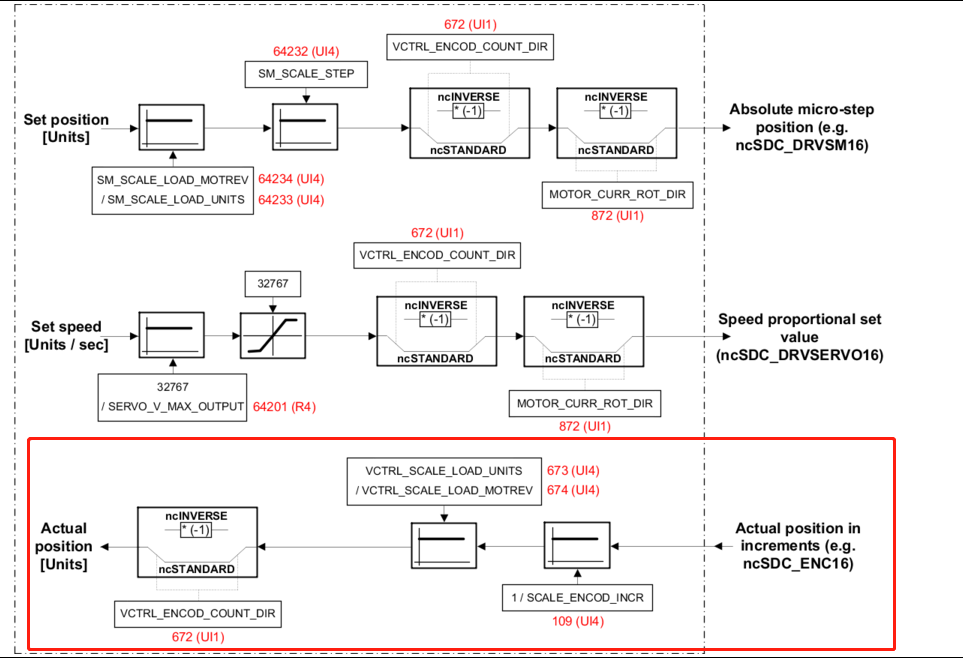
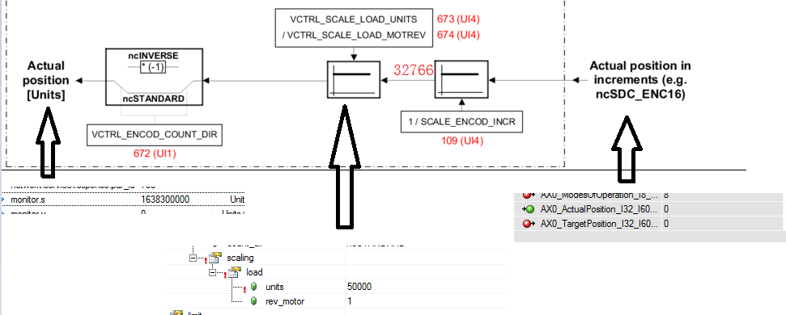
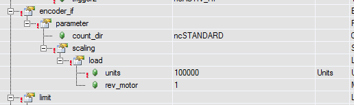
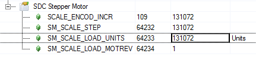

# SDC控制E190伺服时绝对值编码器上电时两侧位置不准确

1. 测试环境

X20CP3586+E190测试demo
AR D4.26  Motion 3.17.2

2. 现象描述

当电机编码器端读数为一个较大负数或者0时，经过转换后得到的实际位置与真实值不符。转换关系如下图。

测试1：

编码器测位置为0，经过Par109后计算后应该也为0，但是经过PLC侧实际位置为1638300000，经过反推，圈数为32766，进一步推算编码器位置为4294705152，此处怀疑数据在寄存器转移的时候发生了符号变化，比如从INT到UINT，或者DINT到UDINT的转移，产生了数据偏差。
INT：-32768-32767
UINT：0-65535
DINT：-2147483648-2147483647
UDINT：0-4294967295
测试2：
编码器位置不为0：

中间转换的ParID变量如下：

计算后的实际位置为：

经过简单的计算后，1.97797069E+09对应的编码器位置应该是2592565742.7968，与真实位置-1702401550偏差为4294967292.7968，跟UDINT的最大值4294967295极为接近。

3. 结论推测

数据在寄存器转移的时候（实际位置或者实际圈数）发生了符号变化，比如从INT到UINT，或者DINT到UDINT的转移，产生了数据偏差。
INT：-32768-32767
UINT：0-65535
DINT：-2147483648-2147483647
UDINT：0-4294967295
注：此问题在PLC侧unit比例等于编码器线数时会消失。

## 解决办法：
因此，这个问题目前只能用程序处理解决，没办法从根源上修复这个bug。因此当你遇到SDC带第三方伺服，并且编码器是绝对值编码器的时候，需要特别小心，注意编码器位置为负值的时候SDC转换位置的突变，如果不妥善处理，可能引发危险。
[2022-06-20 10:28] [SDC+E190伺服绝对值编码器上电时两侧位置不准确.docx (1039.76KiB)](./FILES/011SDC控制E190伺服时绝对值编码器上电时两侧位置不准确.md/SDC+E190伺服绝对值编码器上电时两侧位置不准确.docx){.open}
