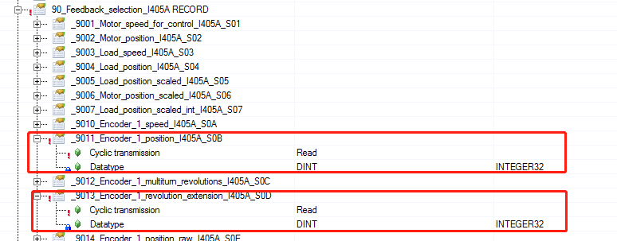

> Tags: #ABB变频器

# A02.012.ABB变频器编码器位置及圈数方向变化

- 如何读取ABB 880及380 变频器编码器位置及圈数，印刷项目中用这些数据计算位置增量。
- 编码器卡：FEN-01
- 电机编码器类型：TTL

# 解决方案

- 编码器卡与电机接线完全按照A+ A- B+ B- Z+ Z-接线
- FPEL_02 配置如下：
    - 
- 1___ ABB 380 编码器位置及圈数位置9011 圈数9013
    - 380变频器位置及圈数是同方向变化，要么同时增加。要么同时减小。
- 2___ ABB 880 编码器位置及圈数位置9011 圈数9013
     - 880变频器位置及圈数有可能存在非同方向变化。位置及圈数变化方向不一致。
- 无法通过参数修改使位置和圈数变化同方向。可以通过更改880编码器接线，A相和B相互换，880变频器位置和圈数就可同方向变化。
