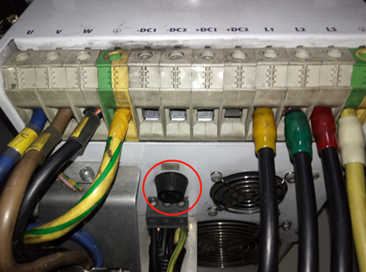

# ACOPOS带大惯量负载减速报警直流母线过压的解决办法
## 问题描述

ACOPOS带大惯量负载减速报警直流母线过压，报警后电机自由停止。
硬件环境
控制器：CP3585
驱动器：ACOPOS1640；
电机：西门子直驱电机；
制动电阻：外置，规格9.6KW/27Ω，2个并联；
负载：卫星式柔印机中心辊筒直径2500mm，幅宽：1450mm。
软件环境
AS版本：AS3.0.90.38
伺服操作系统：V3.18.2

## 原因分析

负载减速造成驱动器直流母线电压升高，超过直流母线电压限制值，因而产生报警。负载减速时，对驱动器ID298：UDC_ACT进行trace，发现负载减速UDC_ACT数值曲线升高，超过900V，产生报警7217。观察UDC_ACT曲线，在负载减速时曲线一直上升而没有下降，由此分析原因为驱动器没有将制动产生的能量在外置制动电阻上进行释放。
1、检查制动单元内置保险丝，发现保险丝导通正常，保险丝位置如下图所示。

 
2、在已有的外接制动电阻处，并上电阻，减小外接制动电阻的阻值，增加外接制动电阻的功率，同时修改参数ID R_BLEEDER_EXT与外接制动电阻阻值一致，再次进行试验仍然报警驱动器直流母线电压过压，trace曲线UDC_ACT与未作修改前一致。
3、在负载减速时，外接制动电阻温度没有升高，因此判断外置制动电阻没有工作。

## 解决方案

修改驱动器制动电阻启用直流母线电压参数ID：UDC_BLEEDER_ON的默认值770V为660V。
修改后再次进行试验，在负载减速时trace曲线UDC_ACT，在UDC_ACT数值超过660V之后基本不再上升，也不再产生报警直流母线过压。