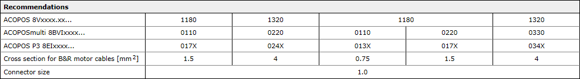
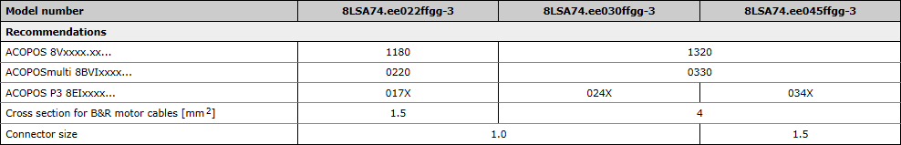
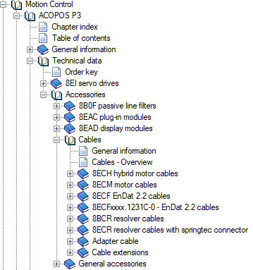

> Tags: #电机

- [1 8LS电机动力电缆选择型号](#_1-8ls%E7%94%B5%E6%9C%BA%E5%8A%A8%E5%8A%9B%E7%94%B5%E7%BC%86%E9%80%89%E6%8B%A9%E5%9E%8B%E5%8F%B7)
- [2 问题描述](#_2-%E9%97%AE%E9%A2%98%E6%8F%8F%E8%BF%B0)
- [3 解决方案](#_3-%E8%A7%A3%E5%86%B3%E6%96%B9%E6%A1%88)

# 1 8LS电机动力电缆选择型号

# 2 问题描述

- 如何选择电机动力电缆？有哪些注意点？

# 3 解决方案

- **电缆类型**
    - 按电缆类型主要有
        - ACOPOS P3用混合电缆 8ECHxxxx.xxxx-0
        - ACOPOS P3用动力电缆 8ECMxxxx.xxxx-0
        - ACOPOS 用动力电缆 8CMxxx.xx-1
        - ACOPOSmulti 用动力电缆 8BCMxxxx.xxxx-0
        - ACOPOSmulti用混合电缆 8BCHxxxx.xxxx-0
    - 一般情况下需根据使用的伺服驱动器种类选择其对应的电缆，原因是不同驱动器电机输出端的屏蔽固定位置不同，所以相应电缆线的屏蔽层及出线长度是不一样的，混用的话容易造成屏蔽层连接固定困难。
    - 混合电缆必须和单电缆的8LS Endat2.2电机配合使用。
- **电缆长度**
    - 确定所需的动力电缆长度，客户需要在设计方案时考虑电机和驱动器之间的距离，尽量不要使用长度大于15米的电缆。长电缆价格贵，且因为对地电容的关系会产生谐波，影响电机控制，甚至会升高dV/dt导致电机温升增加甚至过热，对电机危害很大。在不得已必须使用长距离电缆线时，需考虑输出电抗器的方案。
- **线径与电机侧接头规格**
    - 在电机技术参数中可以找到该电机推荐使用的动力电缆线径及接头大小，如下图
    - 
    - 表格中的Cross section for B&R motor cables即推荐使用的电缆线径，一般有0.75，1.5， 4，10这几种规格（单位为mm^2）；Connector size即电机侧连接的接头大小有1.0和1.5两种规格。另外还有35 mm^2的电缆，一般用于配套8KS这类电机使用。
    - 注意有些电缆在线径相同的情况下，存在有1.0和1.5两种不同规格的接头规格，以匹配不同大小的电机。
    - 例8LSA74 4500转电机，电缆线径推荐使用4.0 mm^2，但是接头大小为1.5，属于大接头；而8LSA74 3000转的电机，同样是4.0 mm^2的线径，却用的是1.0规格的接头。如果选错电缆会造成现场无法安装的窘境。
    - 
- **是否可用于拖链**
    - ACOPOS及ACOPOS P3的动力电缆均可用于拖链，对于ACOPOSmulti的动力电缆分可用于和不可用于拖链两种规格。
- **哪里能找到电缆规格数据列表**
    - 以帮助中ACOPOS P3的电缆为例，在如下位置：
    - Guid：ec13afdc-8687-47e5-89df-010abe11ecab
    - 
