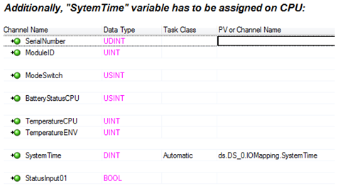

# 如何使用Moterky中的DS功能块控制步进电机运动
## 问题描述
如何使用Moterky中的DS功能块控制步进电机运动？ 配合X20DSxxxx模块使用。

## 解决方案
使用步骤：

1、 DS功能块的引脚定义和调用语法如下图：

2、对DS模块的configuration表进行配置如下：

3、 DS模块和CPU的IOmapping如下：

注：
Motorky是总部开发的野库（有库和例程见附件），该库可以控制步进电机、直流电机，也能发脉冲方向控制伺服或变频器。可以做速度控制和位置控制等。
该库包含四个功能块：DS \ FI \ MM \ SM
更多详情请参考motorky的HTML HELP文档