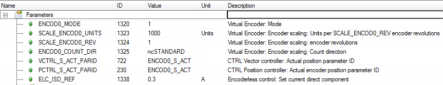
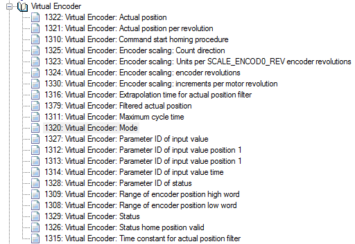
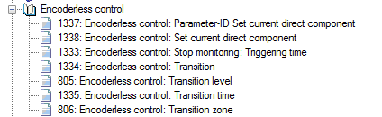

# 如何在没有编码器反馈的情况下控制同步电机
## 问题描述
如何在没有编码器反馈的情况下控制同步电机？
同步伺服电机应该都有编码器信号反馈，如果出于某些原因不接编码器线，又想让电机转起来，如何操作？

## 解决方案
**不接编码器线又想让同步电机运转，需要借助虚拟编码器（Virtual Encoder）。**
在ACOPOS参数表中进行配置。如下图：

注：
更多相关ID的说明可以参考帮助，如下图：

无编码器控制相关参数如下：

