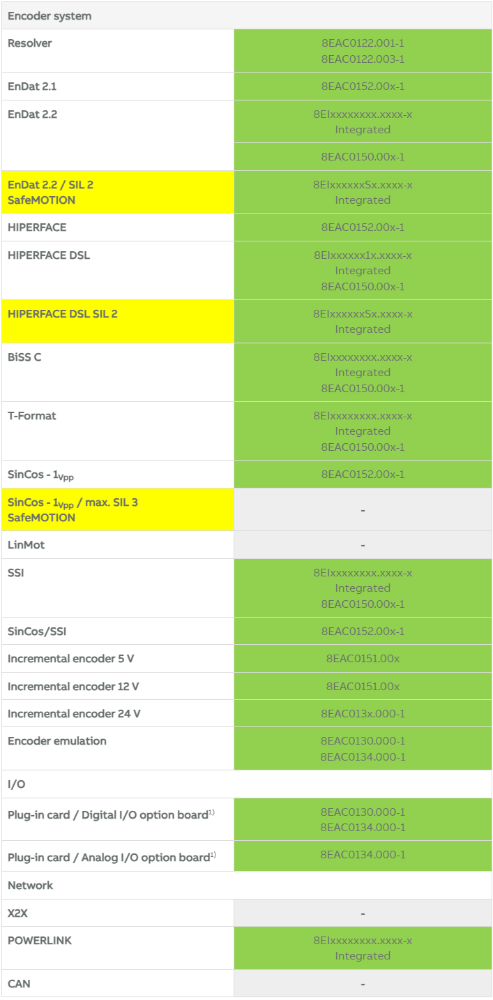

> Tags: #编码器 #ACOPOS #ACOPOSmulti #ACOPOSremote #ACOPOS_P3 #ACOPOSmotor #ACOPOSmicro #ACOPOSinverter

- [033贝加莱驱动器对应编码器型号选择一览](#033%E8%B4%9D%E5%8A%A0%E8%8E%B1%E9%A9%B1%E5%8A%A8%E5%99%A8%E5%AF%B9%E5%BA%94%E7%BC%96%E7%A0%81%E5%99%A8%E5%9E%8B%E5%8F%B7%E9%80%89%E6%8B%A9%E4%B8%80%E8%A7%88)
- [总览](#%E6%80%BB%E8%A7%88)
- [ACOPOS](#ACOPOS)
- [ACOPOSmulti](#ACOPOSmulti)
- [ACOPOSremote](#ACOPOSremote)
- [ACOPOS P3](#ACOPOS%20P3)
- [ACOPOSmotor](#ACOPOSmotor)
- [ACOPOSmicro](#ACOPOSmicro)
- [ACOPOSinverter](#ACOPOSinverter)
- [更新日志](#%E6%9B%B4%E6%96%B0%E6%97%A5%E5%BF%97)

# 033贝加莱驱动器对应编码器型号选择一览

> 来源：[Overview of encoder systems / I/O / Network of the ACOPOS product family | B&R Industrial Automation (br-automation.com)](https://www.br-automation.com/en/products/motion-control/additional-information/overview-of-encoder-systems-io-network-of-the-acopos-product-family/)

# 总览

- 1) 不相关，与 EnDat 2.2 集成
- 2) 支持 CAN 网络，最高支持的版本为ACP10 2.99.9
- 3) 不适用于 ACOPOSmotor Compact

# ACOPOS

- 1) 编码器仿真最高可达 65 kHz 信号频率
- 2) 支持 CAN 网络，最高支持的版本为ACP10 2.99.9

# ACOPOSmulti

- 1) 编码器仿真最高可达 65 kHz 信号频率
- 2) 编码器仿真最高可达 1 MHz 信号频率

# ACOPOSremote

# ACOPOS P3

- 1) 选项卡正在开发中

# ACOPOSmotor

# ACOPOSmicro

# ACOPOSinverter

- 1) 仅适用于 ACOPOSinverter P84

# 更新日志

| 日期     | 修改人     | 修改内容     |
|:-----|:-----|:-----|
| 2024-01-18     | YuanZhiyi     | 初次创建     |
