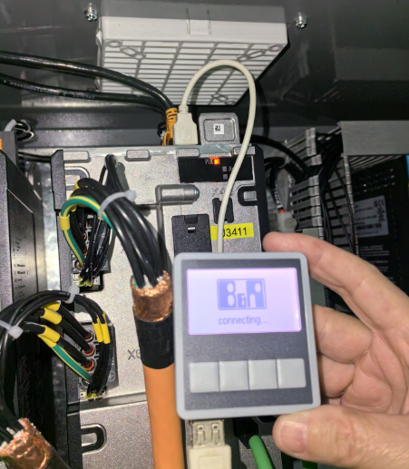
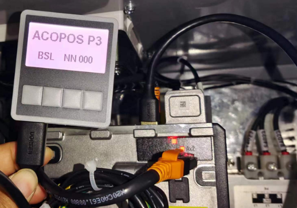

> Tags: #ACOPOS_P3

- [1 034ACOPOS_P3的显示模块8EAD000.000-1能否使用延长线](#1%20034ACOPOS_P3%E7%9A%84%E6%98%BE%E7%A4%BA%E6%A8%A1%E5%9D%978EAD000.000-1%E8%83%BD%E5%90%A6%E4%BD%BF%E7%94%A8%E5%BB%B6%E9%95%BF%E7%BA%BF)
- [2 需求](#2%20%E9%9C%80%E6%B1%82)
- [3 实现方式](#3%20%E5%AE%9E%E7%8E%B0%E6%96%B9%E5%BC%8F)
- [4 更新日志](#4%20%E6%9B%B4%E6%96%B0%E6%97%A5%E5%BF%97)

# 1 034ACOPOS_P3的显示模块8EAD000.000-1能否使用延长线

- 相关说明
    - [031ACOPOS P3如何设置PLK拨码](031ACOPOS%20P3如何设置PLK拨码.md)

# 2 需求

- 使用贝加莱ACOPOS P3驱动器，需要使用8EAD000.000-1进行拨码。
- 由于柜内空间窄，能否使用延长线
- 如下图，使用USB2.0的延长线，并不能识别
- 

# 3 实现方式

- 换用USB 3.0的延长线即可解决此问题
- 
- 

# 4 更新日志

| 日期     | 修改人     | 修改内容     |
|:-----|:-----|:-----|
| 2024-01-18     | YuanZhiyi     | 初次创建     |
