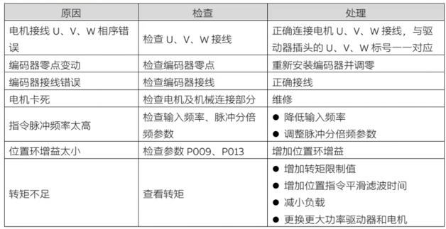

> Tags: #ACOPOS_D1

# 1 A02.036.ACOPOS_D1_Err4位置超差

# 2 现场案列

- 在第一次使能或者第一次回原点时候出现err 4报错。

# 3 措施

- 将驱动器恢复出厂设置后解决。
- 如果进行固件升级，驱动器需要进行恢复出厂参数操作。

# 4 更新日志

| 日期         | 修改人 | 修改内容 |
| :--------- | :-- | :--- |
| 2024-06-24 | ZSY | 初次创建 |
