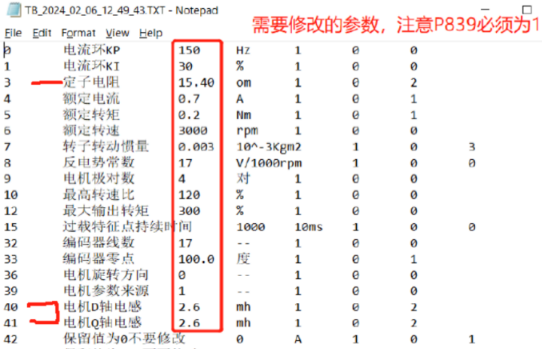
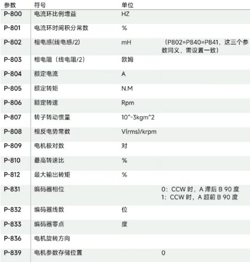
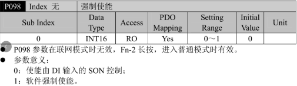

> Tags: #ACOPOS_D1

- [1 A02.038.ACOPOS_D1_FAQ](#_1-a02038acopos_d1_faq)
- [2 P379对象字典](#_2-p379%E5%AF%B9%E8%B1%A1%E5%AD%97%E5%85%B8)
- [3 电机表里的定子电阻和电感，是填线电阻/线电感的数值还是填相电阻/相电感的数值？](#_3-%E7%94%B5%E6%9C%BA%E8%A1%A8%E9%87%8C%E7%9A%84%E5%AE%9A%E5%AD%90%E7%94%B5%E9%98%BB%E5%92%8C%E7%94%B5%E6%84%9F%EF%BC%8C%E6%98%AF%E5%A1%AB%E7%BA%BF%E7%94%B5%E9%98%BB%E7%BA%BF%E7%94%B5%E6%84%9F%E7%9A%84%E6%95%B0%E5%80%BC%E8%BF%98%E6%98%AF%E5%A1%AB%E7%9B%B8%E7%94%B5%E9%98%BB%E7%9B%B8%E7%94%B5%E6%84%9F%E7%9A%84%E6%95%B0%E5%80%BC%EF%BC%9F)
- [4 电流环Kp和电流环KI如何设置？](#_4-%E7%94%B5%E6%B5%81%E7%8E%AFkp%E5%92%8C%E7%94%B5%E6%B5%81%E7%8E%AFki%E5%A6%82%E4%BD%95%E8%AE%BE%E7%BD%AE%EF%BC%9F)
- [5 电机不能进FN5测磁偏角](#_5-%E7%94%B5%E6%9C%BA%E4%B8%8D%E8%83%BD%E8%BF%9Bfn5%E6%B5%8B%E7%A3%81%E5%81%8F%E8%A7%92)
- [6 更新日志](#_6-%E6%9B%B4%E6%96%B0%E6%97%A5%E5%BF%97)

# 1 A02.038.ACOPOS_D1_FAQ

# 2 P379对象字典

- 说明
    - P379：根据POWERLINK总线周期和t_total和t_predict值调整，达到Lagerr在0上下波动
    - P379参数是设置通信周期内生成返回数据的时刻，默认值是6，时刻不一样，会影响指令和反馈的偏差。
    - 一般不需要做调整
- 如果需要调整，怎么用SDO读写？
    - 只能通过伺服面板修改，不能通过SDO读写

# 3 电机表里的定子电阻和电感，是填线电阻/线电感的数值还是填相电阻/相电感的数值？

- 
- 填相电阻和相电感
- 

# 4 电流环Kp和电流环KI如何设置？

- 贝加莱驱动器这个参数是内部自处理的。
- 电流环贝加莱的电机是专门调过的，第三方电机都按P800=110，P801=30 来
- 贝加莱电机如下：
    - 60G系列220V的电机：80/40 60M系列220V的电机：110/3080G系列220V的电机：80/30
    - 80M系列220V的电机：110/30
    - 110G系列220V的电机：110/30
    - 110M系列220V的电机：110/30
    - 110M系列380V的电机：70/30
    - 130G系列220V/380V的电机：85/25
    - 130M系列380V的电机：70/30
    - 130M系列220V的电机：90/25
    - 180M系列380V的电机：100/30
    - G是高惯量的意思，M是中低惯量

# 5 电机不能进FN5测磁偏角

- 是因为P098内部强制使能被保存了
- 把P098改回0就好了
    - 
- 进Fn-20,会自动修改P098 = 1，所以操作Fn-20后，不要操作E-SET，直接断电停下来，就不会保存P098

# 6 更新日志

| 日期         | 修改人        | 修改内容 |
| :--------- | :--------- | :--- |
| 2024-04-03 | ZSY YZY | 初次创建 |
