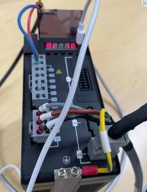
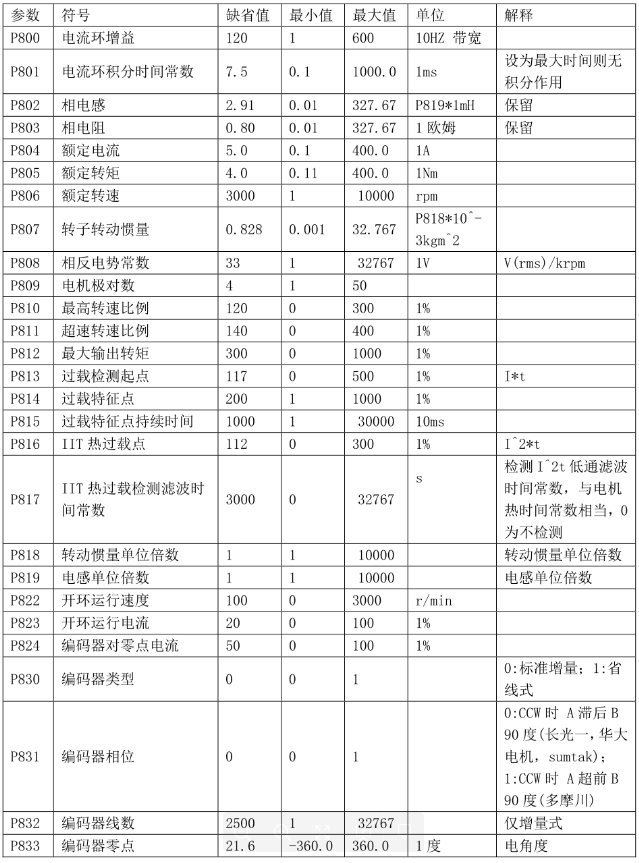
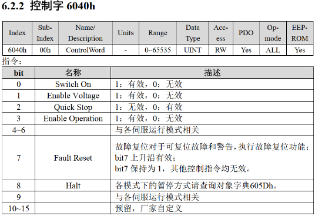
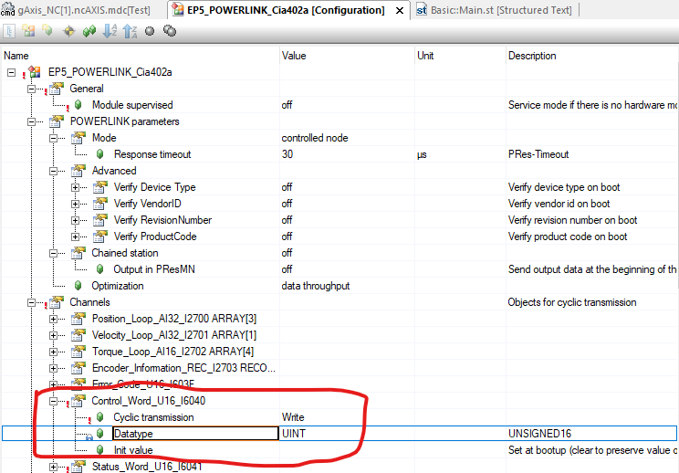
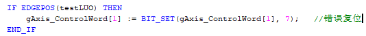

> Tags: #ACOPOS_D1

- [1 A02.039-ACOPOS_D1_Err13错误复位](#_1-a02039-acopos_d1_err13%E9%94%99%E8%AF%AF%E5%A4%8D%E4%BD%8D)
- [2 Err13问题复现](#_2-err13%E9%97%AE%E9%A2%98%E5%A4%8D%E7%8E%B0)
- [3 问题解决方法](#_3-%E9%97%AE%E9%A2%98%E8%A7%A3%E5%86%B3%E6%96%B9%E6%B3%95)
- [4 更新日志](#_4-%E6%9B%B4%E6%96%B0%E6%97%A5%E5%BF%97)

# 1 A02.039-ACOPOS_D1_Err13错误复位

- 当电机过载的时候，伺服会报Err 13的错误，但是使用MC_Reset功能块无法复位
- 

# 2 Err13问题复现

- 对伺服的参数配置表进行修改
    - P000 = 401呼出P8段的参数设置
    - P813 = 1
    - P814 = 1
    - P815 = 100
- 存入EEPROM中后断电重启，上电后即报警Err 13
- 

# 3 问题解决方法

- 根据手册修改控制字6040h来消除报警
    - 
- 首先需要在configuration中添加相关控制字的IO mapping
    - 
- 之后在IO mapping中绑定变量
- 最后只要在需要复位的地方对状态字进行BIT_SET操作即可
    - 

# 4 更新日志

| 日期         | 修改人 | 修改内容 |
| :--------- | :-- | :--- |
| 2024-05-08 | LZH | 初次创建 |
