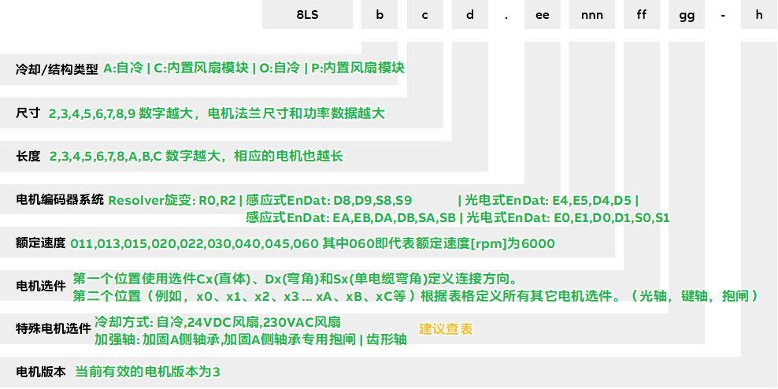

> Tags: #电机

- [1 A02.043.贝加莱8LS电机订购号说明](#_1-a02043%E8%B4%9D%E5%8A%A0%E8%8E%B18ls%E7%94%B5%E6%9C%BA%E8%AE%A2%E8%B4%AD%E5%8F%B7%E8%AF%B4%E6%98%8E)
- [2 总览图](#_2-%E6%80%BB%E8%A7%88%E5%9B%BE)
	- [2.1 例一](#_21-%E4%BE%8B%E4%B8%80)
	- [2.2 例二](#_22-%E4%BE%8B%E4%BA%8C)
- [3 电机尺寸图获取](#_3-%E7%94%B5%E6%9C%BA%E5%B0%BA%E5%AF%B8%E5%9B%BE%E8%8E%B7%E5%8F%96)
- [4 电机版本差异信息](#_4-%E7%94%B5%E6%9C%BA%E7%89%88%E6%9C%AC%E5%B7%AE%E5%BC%82%E4%BF%A1%E6%81%AF)
- [5 更新日志](#_5-%E6%9B%B4%E6%96%B0%E6%97%A5%E5%BF%97)

# 1 A02.043.贝加莱8LS电机订购号说明

- [点击访问 → 贝加莱官方网站 → 8LS订购号 | B&R Industrial Automation](https://www.br-automation.com/zh/products/motion-control/additional-information/8ls-3-order-key/)
- [点击访问 → 贝加莱英文在线Help → 8LS order key](https://help.br-automation.com/#/en/4/hardware%2Fmamot2%2Fkapitel_2_technische_daten%2Fbestellschlussel_8ls...-3_-_smc-version.html)
    - GUID: 127a3669-2b2a-4dc6-b4bf-2013fef8bd9a

# 2 总览图

- 

## 2.1 例一

- 8LSA45.EA030**C3**00-3
- 为应用选择了额定转速为3000 rpm的8LSA45型三相同步电机。由于结构原因，电缆只能连接在电机顶部（“顶部”连接方向）。电机还应配备抱闸、键轴和32线EnDat单圈编码器。
    - 编码器系统的代码 （ee） 是 EA
    - 3000 rpm 额定转速的 （nnn） 代码为 030
    - 其他选项（油封、抱闸、键轴和连接方向）的代码 （ff） 为 **C3**

## 2.2 例二

- 8LSA56.DB045**S8**00-3
- 为应用选择了额定转速为4500 rpm的8LSA56型三相同步电机，由于结构原因，电缆只能连接在电机的背面（旋转连接器），并且必须尽可能紧凑，因此需要单电缆（混合）解决方案。电机还应配备抱闸、光轴、油封和32线EnDat多圈编码器。
    - 编码器系统的代码 （ee） 是 DB
    - 4500 rpm 额定转速的 （nnn） 代码为 045
    - 其他选项 (油封，抱闸，光轴和成角度的单电缆解决方案，旋转连接器) 的代码 (ff) 为 **S8**

# 3 电机尺寸图获取

- [001如何获取贝加莱电机的CAD图纸文件](001如何获取贝加莱电机的CAD图纸文件.md)

# 4 电机版本差异信息

- [044贝加莱8LS电机版本0与3差异](044贝加莱8LS电机版本0与3差异.md)

# 5 更新日志

| 日期                             | 修改人 | 修改内容 |
| :----------------------------- | :-- | :--- |
| 2024-11-30 | YZY | 初次创建 |
