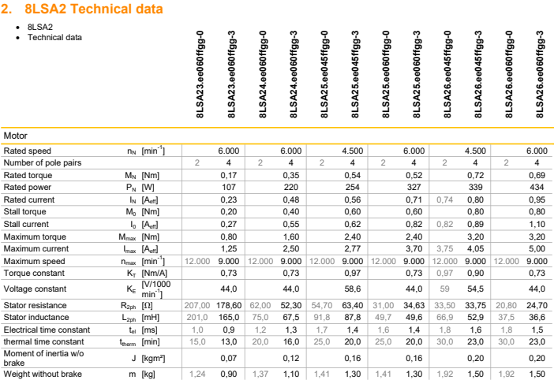
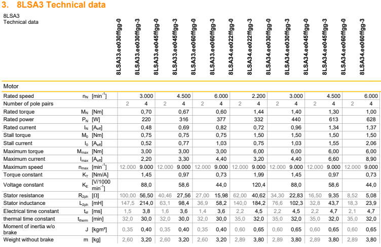
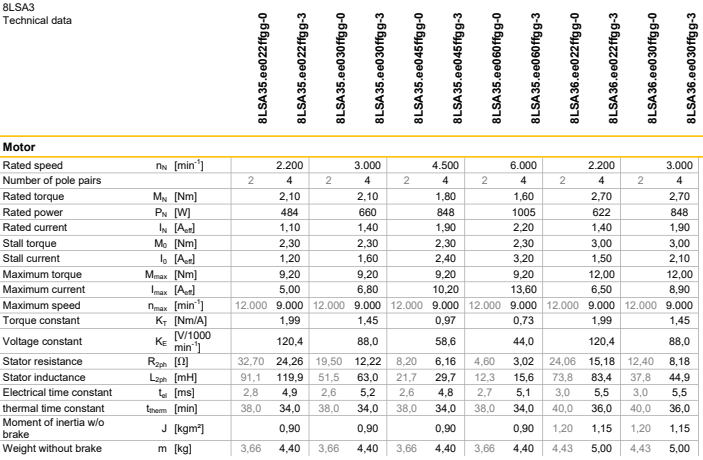
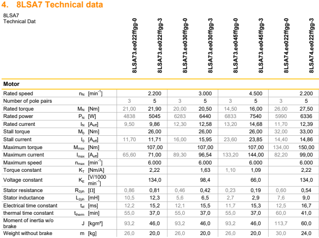
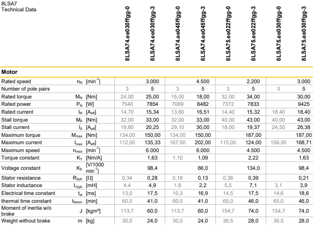

> Tags: #电机

- [1 A02.044.贝加莱8LS电机版本0与3差异](#_1-a02044%E8%B4%9D%E5%8A%A0%E8%8E%B18ls%E7%94%B5%E6%9C%BA%E7%89%88%E6%9C%AC0%E4%B8%8E3%E5%B7%AE%E5%BC%82)
	- [1.1 8LSA2…-0 → 8LSA2…-3](#_11-8lsa2-0-%E2%86%92-8lsa2-3)
	- [1.2 8LSA3…-0 → 8LSA3…-3](#_12-8lsa3-0-%E2%86%92-8lsa3-3)
	- [1.3 8LSA4…-0 → 8LSA4…-3](#_13-8lsa4-0-%E2%86%92-8lsa4-3)
	- [1.4 8LSA5…-1 → 8LSA5…-3](#_14-8lsa5-1-%E2%86%92-8lsa5-3)
	- [1.5 8LSA6…-1 → 8LSA6…-3](#_15-8lsa6-1-%E2%86%92-8lsa6-3)
	- [1.6 8LSA7…-0 → 8LSA7…-3](#_16-8lsa7-0-%E2%86%92-8lsa7-3)
- [2 详细数据对比](#_2-%E8%AF%A6%E7%BB%86%E6%95%B0%E6%8D%AE%E5%AF%B9%E6%AF%94)
- [3 更新日志](#_3-%E6%9B%B4%E6%96%B0%E6%97%A5%E5%BF%97)

# 1 A02.044.贝加莱8LS电机版本0与3差异

- 电机版本差异

## 1.1 8LSA2…-0 → 8LSA2…-3

- 采用先进的磁极绕组技术，尺寸更紧凑
- 技术参数变更
    - 电阻、电感、极对数和重量
    - 🔴需要更改电机参数

## 1.2 8LSA3…-0 → 8LSA3…-3

- 采用先进的磁极绕组技术，尺寸更紧凑
- 技术参数变更
    - 电阻、电感、极对数和重量
    - 🔴需要更改电机参数

## 1.3 8LSA4…-0 → 8LSA4…-3

- 尺寸的微小变化
- 🟢技术参数无变更

## 1.4 8LSA5…-1 → 8LSA5…-3

- 尺寸的微小变化
    - 带有感应式EnDat 2.1编码器 (EA/EB) 的8LSA5更长11毫米
- 🟢技术参数无变更

## 1.5 8LSA6…-1 → 8LSA6…-3

- 尺寸的微小变化
    - 带有感应式EnDat 2.1编码器 (EA/EB) 的8LSA6更长11毫米
- 🟢技术参数无变更

## 1.6 8LSA7…-0 → 8LSA7…-3

- 采用先进的磁极绕组技术，尺寸更紧凑，所有类型都更短
- 技术参数变更
    - 技术数据进行了优化，有显著变化，例如电阻、电感、极对数、惯性和重量
    - 🔴请使用servosoft检查应用程序数据
    - 🔴请检查控制参数
    - 🔴需要更改电机参数

# 2 详细数据对比

- 
- 
- 
- 
- 
- 

# 3 更新日志

| 日期         | 修改人 | 修改内容 |
| :--------- | :-- | :--- |
| 2014-11-03 | HQ  | 创建   |
| 2024-11-30 | YZY | 更新   |
