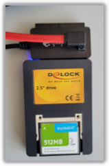

> Tags: #CF卡 #CFast卡

- [1 A03.002.如何获得CF卡与CFast卡在不同工况下的运行寿命](#_1-a03002%E5%A6%82%E4%BD%95%E8%8E%B7%E5%BE%97cf%E5%8D%A1%E4%B8%8Ecfast%E5%8D%A1%E5%9C%A8%E4%B8%8D%E5%90%8C%E5%B7%A5%E5%86%B5%E4%B8%8B%E7%9A%84%E8%BF%90%E8%A1%8C%E5%AF%BF%E5%91%BD)
- [2 方法一使用贝加莱PLC读取](#_2-%E6%96%B9%E6%B3%95%E4%B8%80%E4%BD%BF%E7%94%A8%E8%B4%9D%E5%8A%A0%E8%8E%B1plc%E8%AF%BB%E5%8F%96)
- [3 方法二使用笔记本软件读取](#_3-%E6%96%B9%E6%B3%95%E4%BA%8C%E4%BD%BF%E7%94%A8%E7%AC%94%E8%AE%B0%E6%9C%AC%E8%BD%AF%E4%BB%B6%E8%AF%BB%E5%8F%96)
	- [3.1 CF卡](#_31-cf%E5%8D%A1)
	- [3.2 CFast卡](#_32-cfast%E5%8D%A1)

# 1 A03.002.如何获得CF卡与CFast卡在不同工况下的运行寿命

# 2 方法一使用贝加莱PLC读取

- 使用SDM或者ArStorage库获取存储介质寿命情况。
- [033通过SDM查看存储设备的健康情况-Storage wear](../B03_技术_诊断/033通过SDM查看存储设备的健康情况-Storage%20wear.md)
- 👍优势：对于CF卡的寿命读取会较为方便
- 注1：参见Automation Studio帮助 Guid ID：15e55f50-8140-49b8-b7c0-8c6ea1dc8a65。
- 注2：该库仅针对SG4的系统，AR 需在V4.90或更高版本中使用。

# 3 方法二使用笔记本软件读取

- 对于具有S.M.A.R.T 功能的 CF/CFast 卡可通过 swissbit 公司的 SBLTM 软件获取 CF 卡运行1个周期的 AEC 差值，再根据 CF/CFast 卡的 Clear/Write cycles 值，
- 从而计算出 CF/CFast 卡大致运行寿命：
    - 1)	通过 S.M.A.R.T 读取数据存储介质的“平均擦除计数”
    - 2)	在规定的一段时间内(如1周)，用相关的数据存储介质完全操作系统。
    - 3)	通过“平均擦除计数”确定使用的擦除周期。
    - 4)	根据最大保证写/擦除周期 (MLC: 3000, SLC: 100,000)确定预期的使用寿命。
    - 5)	SBLTM 软件（SBLTM – Life Time Monitoring Tool for Windows）不是贝加莱官方软件，如有需要请访问 [适用于工业应用的安全和存储解决方案 - Swissbit](https://www.swissbit.com/zh/) 注册后下载获取。
- 参见Automation Studio帮助 Guid ID：6c5d0a49-0468-4100-91c0-f30712abd55a

## 3.1 CF卡

- ⭐CF 卡的S.M.A.R.T 数值可以通过具有 CF 卡槽与硬盘卡槽的贝加莱工控机读取
    - 例如把 CF 卡插在 ACP 810 的 CF 卡槽中，APC 安装 Windows 系统，APC 上运行 SBLTM 软件获取信息。
    - 因为 SBTML 软件只能使用在 IDE 控制器平台上，CF 卡是通过 USB 适配器介入笔记本电脑，因此会出现无法识别的现象。
- 使用额外的转换器硬件，可以在笔记本电脑上读取CF S.M.A.R.T 数据 （注意：此硬件较难购买）
    - 将CF与DELOCK 2.5英寸IDE读卡器连接（CF到IDE）
    - 用配备的 IDE 转 USB 适配器连接 IDE 读卡器
    - 将两个 USB 电缆都连接到笔记本电脑
    - 电脑上使用SBLTM（Swiss Bit Life Time Monitoring）软件读取信息（使用 V1.6.6 进行测试）
    - 

## 3.2 CFast卡

- CFast 卡的S.M.A.R.T 数据可通过普通电脑获取，使用一般的读卡器即可。
