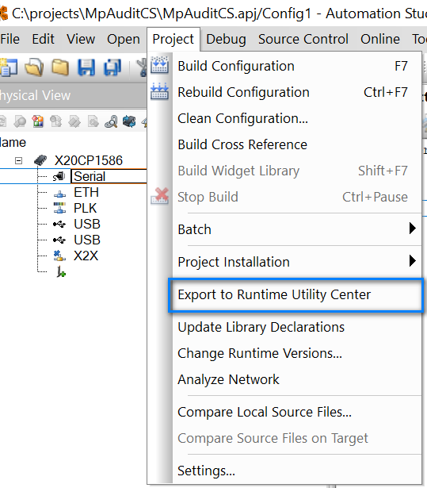
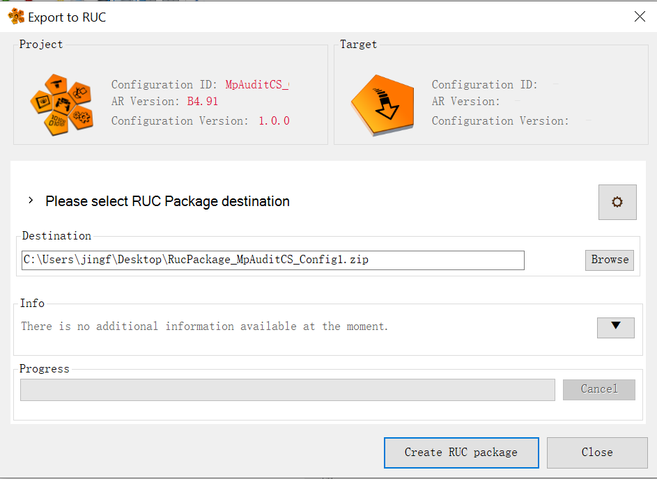
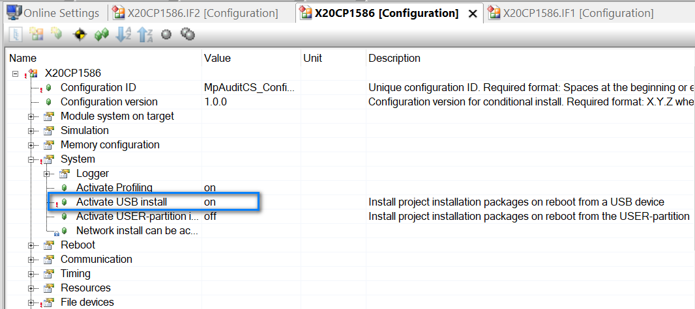
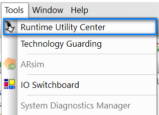
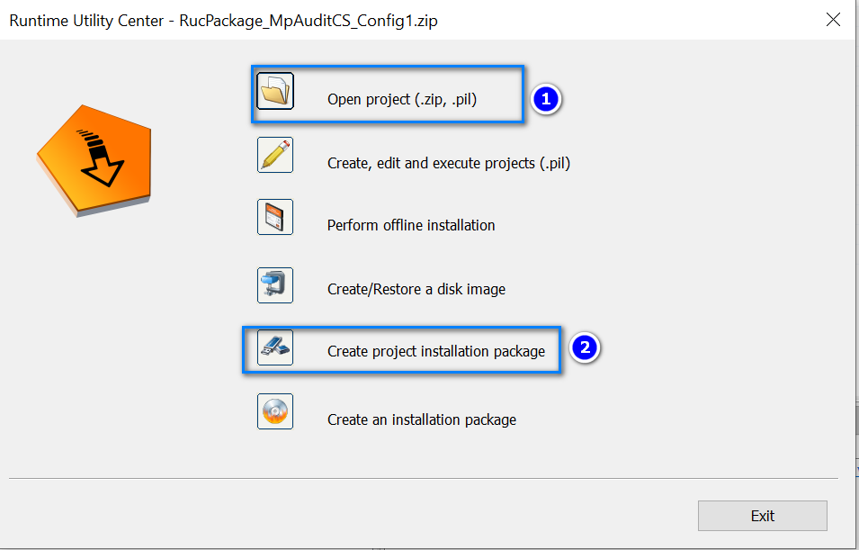
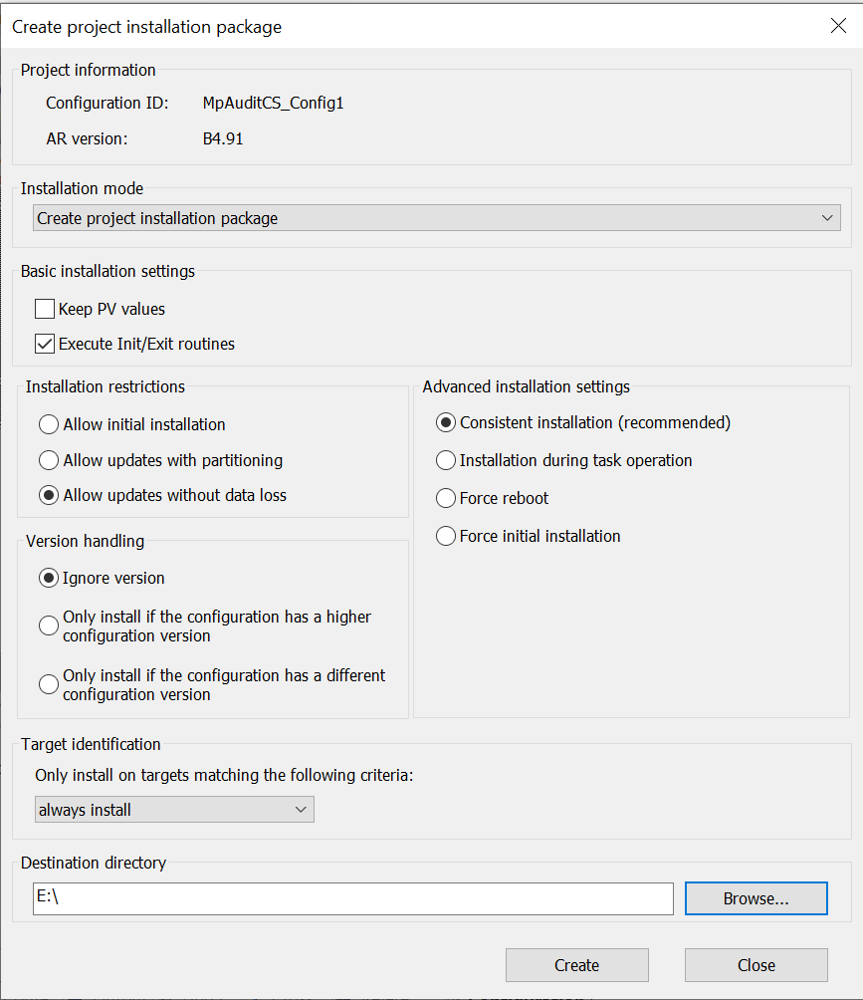

# 003如何通过USB接口将项目文件下载至PLC中？
通过下载包下载程序（下载包替代源程序，包括USB下载）
下载包安装程序的好处是，可以保证源程序的保密，防止知识产权的泄露。
首先产生下载包，点击Project，在下拉菜单中点击Exprot to RUC。

在弹出的界面里，可以选择文件存储的路径和文件名。然后点击Create。结束后，点Close即可。安装包既保持到了相关路径下，使用时去该路径提取即可。

使用USB下载，首先需要控制的右键Configuration里面，需要有相关设置，默认是不允许USB下载程序的，当把USB安装设置为on后，才能通过USB下载程序。当然，一定是PLC里的程序是已经设置成允许USB下载的。

制作U盘安装文件，先点Tools，然后点开RUC（Runtime Utility Center）

在RUC界面，首先点Open project，在安装包保持的路径下，打开安装包。

然后，点击Creat project installation package，默认设置即可，如果版本不同，请仔细看相关设置。U盘路径选择一级路径即可。

完成后，系统会提示成功。把U盘查到控制器上，重启，程序即可更新。
