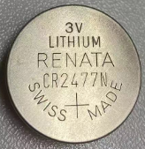
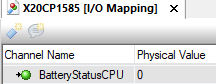
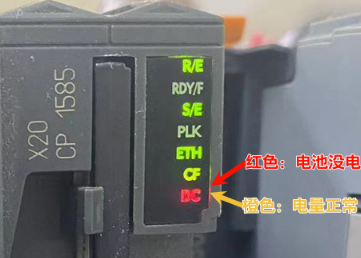
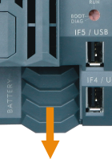
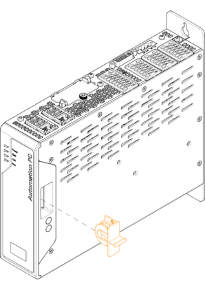
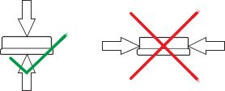
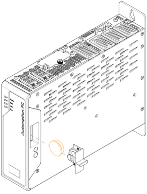

> Tags: #电池

- [1 A03.005.PLC与APC等设备电池电量耗尽会有什么影响？如何购买新的电池？](#_1-a03005plc%E4%B8%8Eapc%E7%AD%89%E8%AE%BE%E5%A4%87%E7%94%B5%E6%B1%A0%E7%94%B5%E9%87%8F%E8%80%97%E5%B0%BD%E4%BC%9A%E6%9C%89%E4%BB%80%E4%B9%88%E5%BD%B1%E5%93%8D%EF%BC%9F%E5%A6%82%E4%BD%95%E8%B4%AD%E4%B9%B0%E6%96%B0%E7%9A%84%E7%94%B5%E6%B1%A0%EF%BC%9F)
- [2 备份电池数据](#_2-%E5%A4%87%E4%BB%BD%E7%94%B5%E6%B1%A0%E6%95%B0%E6%8D%AE)
- [3 监控电池状态](#_3-%E7%9B%91%E6%8E%A7%E7%94%B5%E6%B1%A0%E7%8A%B6%E6%80%81)
- [4 电池更换周期](#_4-%E7%94%B5%E6%B1%A0%E6%9B%B4%E6%8D%A2%E5%91%A8%E6%9C%9F)
- [5 有关电池更换的重要信息](#_5-%E6%9C%89%E5%85%B3%E7%94%B5%E6%B1%A0%E6%9B%B4%E6%8D%A2%E7%9A%84%E9%87%8D%E8%A6%81%E4%BF%A1%E6%81%AF)
- [6 更换电池的步骤](#_6-%E6%9B%B4%E6%8D%A2%E7%94%B5%E6%B1%A0%E7%9A%84%E6%AD%A5%E9%AA%A4)
	- [6.1 X20CPx58x系列_X20CPx68x系列](#_61-x20cpx58x%E7%B3%BB%E5%88%97_x20cpx68x%E7%B3%BB%E5%88%97)
	- [6.2 APC3100工控机](#_62-apc3100%E5%B7%A5%E6%8E%A7%E6%9C%BA)

# 1 A03.005.PLC与APC等设备电池电量耗尽会有什么影响？如何购买新的电池？

- 电池电量彻底耗尽会让PLC丢失：
    - 存储在CMOS中内部时钟数据导致时钟不准
    - 原先存储的掉电保持变量数据；
- 贝加莱PLC中使用的是CR2477N型号电池。
- 可联系贝加莱进行购买，或者从第三方渠道自行购买。
- X20 控制器配有锂电池。锂电池位于一个单独的隔间内，并有盖子保护。

# 2 备份电池数据

- 使用电池型号为：Renata CR2477N 电池
    - X20CPx58x、X20CPx68x、APC2200、APC3100等均使用此类电池
- 

| 类别   | 说明                      |
| ---- | ----------------------- |
| 订单号  | 4A0006.00-000 1 片    |
| 订单号  | 0AC201.91 4 片        |
| 简单说明 | 锂电池, 3 V / 950 mAh，纽扣电池 |
| 存储温度 | -40 to 85°C             |
| 存储时间 | 最大 3 年（30°C）            |
| 相对湿度 | 0 to 95% (非冷凝)          |

- 以下区域的变量内容靠电池缓存
    - Remanent variables 掉电保持变量
    - 用户 RAM
    - 系统 RAM
    - 实时时钟

# 3 监控电池状态

- 系统对锂电池电压进行周期性检测。
- 对蓄电池进行周期性负载测试并不会大大缩短其使用寿命，若电池电量不足会发出预警。
- 通过系统库AsHW库中函数 "HwGetBatteryInfo() "
    - GUID: 490e110d-c22d-4584-b048-e65fccfc4135
    - [HwGetBatteryInfo() 在线帮助](https://help.br-automation.com/#/en/4/libraries%2Fashw%2Ffbks%2Fhwgetbatteryinfo.html)
        - HwGetBatteryInfo.state = ASHW_BATTERY_LOW(0) 电池电量耗尽或不存在
        - HwGetBatteryInfo.state = ASHW_BATTERY_OK(1) 电池电量正常
- 通过控制器的 I/O mapping 获得状态信息 "BatteryStatusCPU"
    - [BatteryStatusCPU 在线帮助](https://help.br-automation.com/#/en/4/hardware%2Fx20_technische_information%2Fx20_datenpunkt_allg%2Fbatteriestatuscpu.html)
    - 
    - 0 电池电量耗尽或不存在
    - 1 电池电量正常
- 通过查看PLC的LED即可了解
    - 以X20CP1585为例，红色代表电池没电，橙色代表电量正常。
    - [相关的贝加莱官方帮助链接信息](https://help.br-automation.com/#/en/4/hardware%2Fx20cp368x%28x%29%2Fstatus_leds.html)
    - 

# 4 电池更换周期

- 电池应 每 4 年 更换一次。
- B&R 建议的更换周期反映了蓄电池的平均使用寿命和运行条件。它们与最长缓冲时间不一致！

# 5 有关电池更换的重要信息

- 产品设计允许在控制器处于无电压状态时以及在控制器接通电源时更换电池。
- 但在某些国家，不允许在有工作电压的情况下更换电池。
- 为防止数据丢失，必须在无电压状态下 1 分钟内更换电池。
- 🔴警告！
    - 仅允许使用 Renata CR2477N 电池更换电池。使用其他电池可能会引起火灾或爆炸。
    - 如果处理不当，电池可能会爆炸。请勿对电池进行充电、拆卸或将其丢弃在火中。

# 6 更换电池的步骤

## 6.1 X20CPx58x系列_X20CPx68x系列

- 1___在顶帽导轨或接地连接处进行静电放电（不要将手伸入供电装置！）
- 2___取下锂电池盖。将其向下滑动并远离控制器。
    - 
- 3___将空电池从电池座中推出。
- 4___务必确保不要用潮湿或油腻的手指处理新电池。也可以使用塑料镊子。请勿用钳子或金属镊子接触电池→短路！
- 5___要将电池插入电池座，请将“+”面朝上放在电池座的右侧。然后将电池按入电池座。
- 6___盖上盖子。
- 信息：锂电池属于危险废物！用过的电池应根据当地适用的法规进行处理。

## 6.2 APC3100工控机

 - 1___断开 B&R 工业 PC 的电源线（断开电源线）。
 - 2___对外壳或接地连接处进行静电放电。
 - 3___取下设备的电池适配器（防止极性反接）。
 - 4___从适配器中取出电池并更换。
     - 
 - 5___更换电池。注意：不允许抓住电池的边缘。可以使用绝缘镊子插入电池。
     - 重新插入时，请注意极性。适配器上标有正极；这必须与电池的正极相匹配。
     - 
     - 
 - 6___将电池适配器重新插入设备。
 - 7___将电源重新连接到 B&R 工业 PC（连接电源连接器）。
 - 8___在 BIOS 中再次设置日期和时间。
