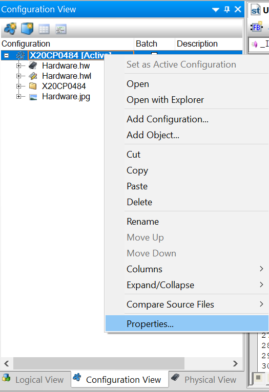

> Tags: #AS #备份 #程序上载

- [1 006贝加莱控制器是否支持上载程序，在支持的情况下如何上载](#_1-006%E8%B4%9D%E5%8A%A0%E8%8E%B1%E6%8E%A7%E5%88%B6%E5%99%A8%E6%98%AF%E5%90%A6%E6%94%AF%E6%8C%81%E4%B8%8A%E8%BD%BD%E7%A8%8B%E5%BA%8F%EF%BC%8C%E5%9C%A8%E6%94%AF%E6%8C%81%E7%9A%84%E6%83%85%E5%86%B5%E4%B8%8B%E5%A6%82%E4%BD%95%E4%B8%8A%E8%BD%BD)
- [2 下载设置](#_2-%E4%B8%8B%E8%BD%BD%E8%AE%BE%E7%BD%AE)
- [3 上载设置](#_3-%E4%B8%8A%E8%BD%BD%E8%AE%BE%E7%BD%AE)

# 1 006贝加莱控制器是否支持上载程序，在支持的情况下如何上载

> ⭐ [建议查看版本 → 089项目源码程序如何在下载程序时备份于CF卡中](/B01_技术_AutomationStudio/089项目源码程序如何在下载程序时备份于CF卡中.md)

- 贝加莱的控制器支持上载程序。但由于该功能非常占用存储空间，并且项目人员在开发时出于保密原因，一般不会启用该功能。
- 如当前项目开启该功能的情况下则支持上载。具体的设置方法如下

# 2 下载设置

- 首先，进入Configuration View里的CPU属性。
    - 
- 在源文件页面下，设置下载源程序到目标中即可。
    - 

# 3 上载设置

- 首先，连接上PLC后，点击从目标打开程序，然后会提示存续保持路径，点确认即可。
    - 
