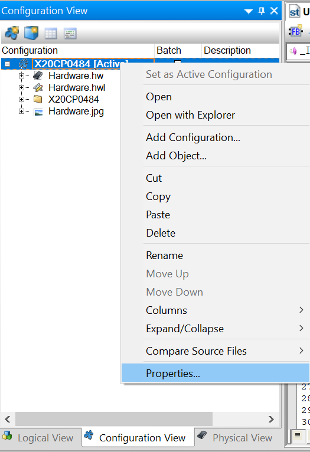
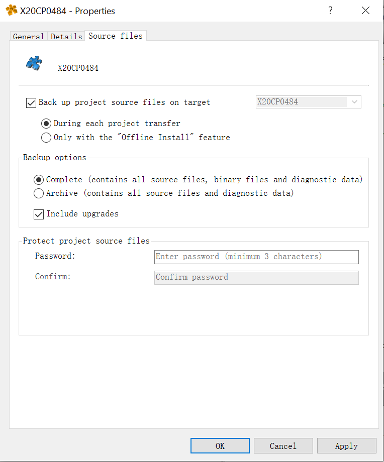
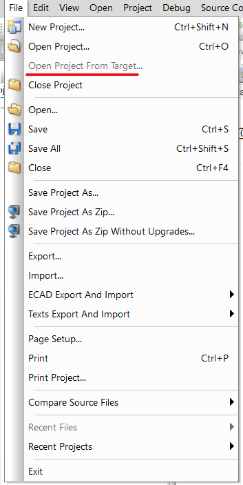

# 006贝加莱控制器是否支持上载程序，在支持的情况下如何上载？
Tags：下载、上载、源程序
A：
贝加莱的控制器支持上载程序。但由于该功能非常占用存储空间，并且项目人员在开发时出于保密原因，一般不会启用该功能。
如当前项目开启该功能的情况下则支持上载。具体的设置方法如下：

1.下载设置：
首先，进入Configuration View里的CPU属性。

在源文件页面下，设置下载源程序到目标中即可。

2.上载设置：
首先，连接上PLC后，点击从目标打开程序，然后会提示存续保持路径，点确认即可。

