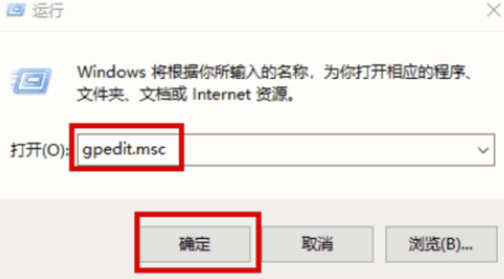

# 014贝加莱工控机访问局域网其他电脑的共享文件夹
## 问题
贝加莱PPC里面安装了贝加莱自带的Window系统，想读取另外一台笔记本电脑上的共享文件夹，已经创建好了局域网，但是一直访问不了。而使用其他笔记本电脑接到这个局域网，测试过这个共享文件夹是可以访问的。
## 解决方式
此问题需要修改Win10网络策略
1. 运行(win+r),输入`gpedit.msc`启动本地组策略编辑器；

2. 依次找到计算机配置->管理模板->网络->Lanman.工作站这个节点，点击右侧"启用不安全的来宾登录"，把状态"未配置"改成"已启用"；

3. 运行(win+r)，输入cmd打开命令提示符，刷新一下组策略。

