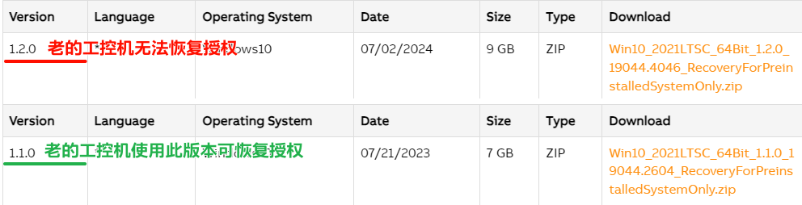

> Tags: #工控机 #Hypervisor #授权

- [1 A03.026.工控机Windows授权问题](#_1-a03026%E5%B7%A5%E6%8E%A7%E6%9C%BAwindows%E6%8E%88%E6%9D%83%E9%97%AE%E9%A2%98)
- [2 问题](#_2-%E9%97%AE%E9%A2%98)
- [3 贝加莱工控机的授权存储位置](#_3-%E8%B4%9D%E5%8A%A0%E8%8E%B1%E5%B7%A5%E6%8E%A7%E6%9C%BA%E7%9A%84%E6%8E%88%E6%9D%83%E5%AD%98%E5%82%A8%E4%BD%8D%E7%BD%AE)
- [4 Windows授权在CFAST更换、镜像恢复的影响](#_4-windows%E6%8E%88%E6%9D%83%E5%9C%A8cfast%E6%9B%B4%E6%8D%A2%E9%95%9C%E5%83%8F%E6%81%A2%E5%A4%8D%E7%9A%84%E5%BD%B1%E5%93%8D)
- [5 Windows授权检查机制](#_5-windows%E6%8E%88%E6%9D%83%E6%A3%80%E6%9F%A5%E6%9C%BA%E5%88%B6)
- [6 已有授权，镜像恢复失败解决方式](#_6-%E5%B7%B2%E6%9C%89%E6%8E%88%E6%9D%83%EF%BC%8C%E9%95%9C%E5%83%8F%E6%81%A2%E5%A4%8D%E5%A4%B1%E8%B4%A5%E8%A7%A3%E5%86%B3%E6%96%B9%E5%BC%8F)

# 1 A03.026.工控机Windows授权问题

# 2 问题

- 贝加莱工控机的Windows正版授权是存储在哪里的？
- 工控机的CFAST卡更换，重新制作镜像，是否会对授权造成影响？
- Windows授权问题如何检查的？

# 3 贝加莱工控机的授权存储位置

- 存储在工控机的主板上，在订货时，授权固定在贝加莱硬件上
- 若到货后无授权的工控机设备希望重新获得Windows授权，需要将交由贝加莱总部处理增加。

# 4 Windows授权在CFAST更换、镜像恢复的影响

- 在工控机设备上有授权的情况下，通过以下方式授权自动恢复
    - 通过Macrium Reflect或者RUC软件进行镜像恢复
    - 通过官方Windows镜像重新制作系统
- 有授权的工控机的CAST卡互换，授权会丢失

# 5 Windows授权检查机制

- 通过以下方式操作，如果没有授权则会提示授权失败
    - 设备联网，自动检查
    - Windows系统设置 --> 系统 --> 关于

# 6 已有授权，镜像恢复失败解决方式

- 现象
    - 以往工控机还原安装别的同配置机器制作的镜像文件（Windows+Hypervisor）后Windows是会自动激活的（已购买授权），但这一次没有
- 解决方式
    - 尝试重新安装一次镜像文件
- 镜像下载地址
    - [Windows 10 Recovery Solution Image (2021 LTSC) | B&R Industrial Automation (br-automation.com)](https://www.br-automation.com/en/downloads/software/operating-systems/windows-10-iot-enterprise-2021-ltsc/windows-10-recovery-solution-image-2021-ltsc/)
    - 贝加莱官网 → Software → Operation systems
- 若恢复镜像后仍没有恢复授权
    - 可能此APC硬件的授权模式与对应的Window 10镜像不匹配，可考虑降低操作系统镜像重新安装
    - 
