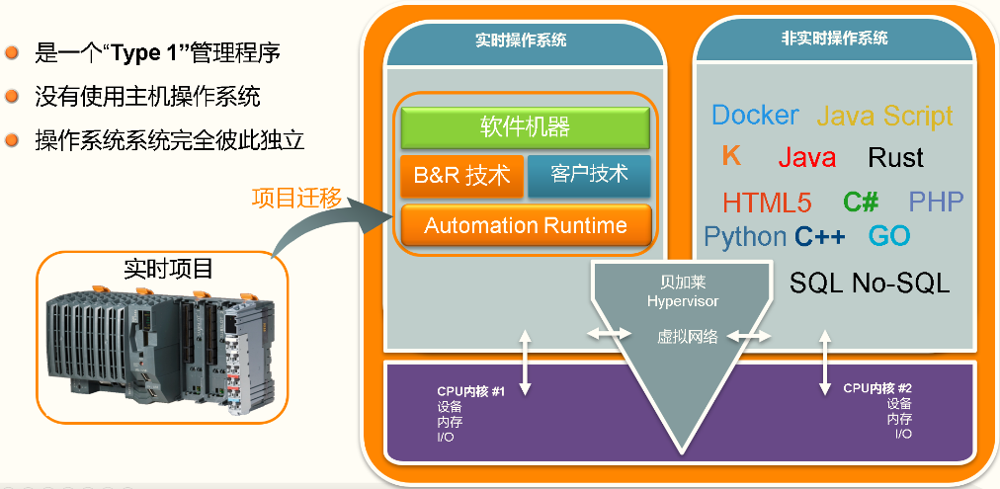

> Tags: #Hypervisor

# A03.027.贝加莱工控机是否支持双系统方案

- 支持，贝加莱工控机支持Hypervisor方案，能够实现贝加莱实时操作系统Automation Runtime与Windows/Linux在同一台设备上运行。
- 
- 详情请查看 [Hypervisor使用助手 (brhelp.cn)](https://hypervisor.brhelp.cn/index.html?general.html)
