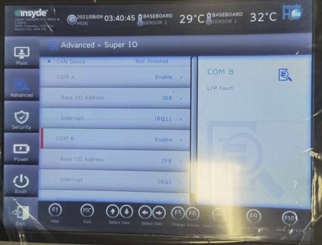

# 028PPC2200触摸失效

- BIOS设置检查：COM B设置为Enable，再按F10保存。
- 

- Windows驱动检查：ADI驱动（ADI driver universal (Win10 64-bit)）与Touch Screen驱动（Touch driver B&R ）已安装并进行设置

- Linux驱动检查：MTCX driver (B&R Linux 10)与Touch Screen Settings (B&R Linux 10)已安装，并完成校准设置
