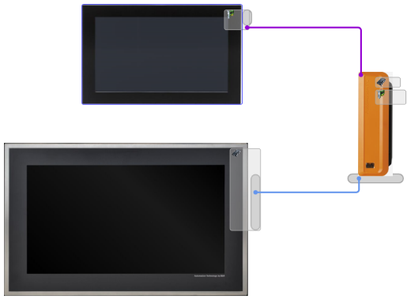

# A03.032.一台工控机如何接两个HMI显示两个独立的画面

- 显示两个不同的画面，需要一张额外的扩展卡，加上本身的SDL口，可以显示两个独立的画面
- 

# APC系列对HDMI屏幕的支持性

- 1.贝加莱工控机可以通过 DP → HDIMI 和 DVI/SDL→ HDMI 来实现接入接口为HDMI的市面高清大屏
- 2.最新的APC910 DP口支持最新的4K 高清V1.2版本
- 

# 相关信息

- [043APC910同时让DP和DVI显示输出](043APC910同时让DP和DVI显示输出.md)
