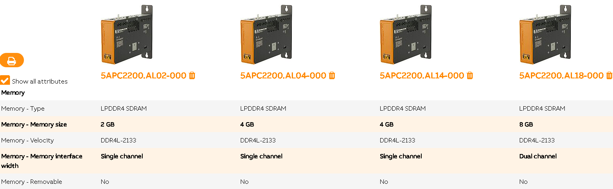
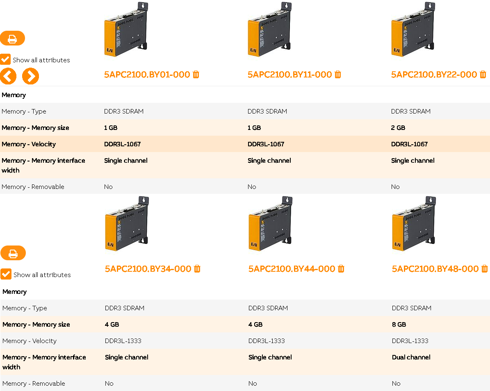

# APC3100
- 最大支持的内存容量为32GB
- 官方单条可选内存最大为16GB 
    - [5MMDDR.016G-04](https://www.br-automation.com/en/products/industrial-pcs/automation-pc-3100/main-memory/5mmddr016g-04/)
- 主板支持的内存插槽与大小

| Memory slot               |            |
| ------------------------- | ---------- |
| Number of memory channels | 2          |
| Type                      | DDR4 SDRAM |
| Memory size               | Max. 32 GB |
| Max. memory bandwidth     | 34.1 GB/s  |

# APC2200
- 根据所选APC2200型号，内存大小不同，最小2GB，最大8GB

# APC2100
- 根据所选APC2100型号不同，内存大小不同，最小1GB，最大8GB
- 

# APC910
- 最大支持的内存大小为32GB
- 官方内存单条最大容量为16GB
    - [5MMDDR.016G-04](https://www.br-automation.com/en/products/industrial-pcs/automation-pc-910/main-memory/5mmddr016g-04/)
- 主板支持的内存插槽与大小

| Memory slot               |            |
|---------------------------|------------|
| Number of memory channels | 2          |
| Type                      | DDR4       |
| Memory size               | Max. 32 GB |
| Max. memory bandwidth     | 34.1 GB/s  |

