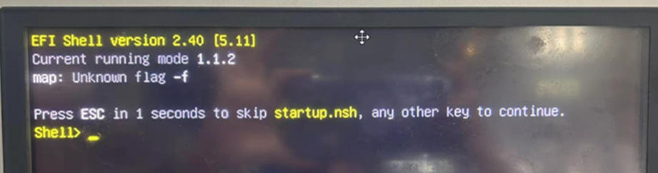
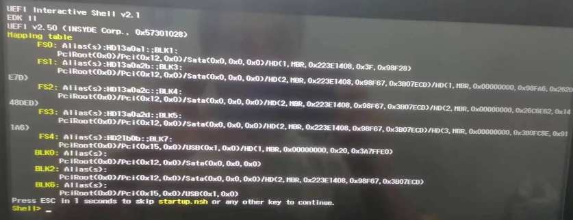
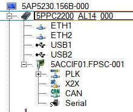
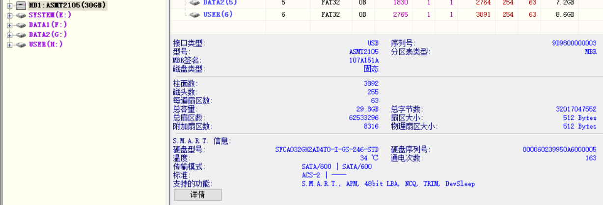
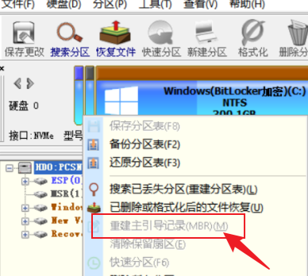
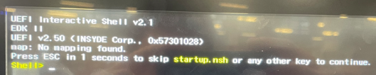

> Tags: #PPC #黑屏

- [1 ⭐问题汇总页](#_1-%E9%97%AE%E9%A2%98%E6%B1%87%E6%80%BB%E9%A1%B5)
- [2 现象一：map: Unknown flag -f](#_2-%E7%8E%B0%E8%B1%A1%E4%B8%80%EF%BC%9Amap-unknown-flag--f)
	- [2.1 解决方法](#_21-%E8%A7%A3%E5%86%B3%E6%96%B9%E6%B3%95)
- [3 现象二：在线更新程序报错，启动后进入startup.nsh](#_3-%E7%8E%B0%E8%B1%A1%E4%BA%8C%EF%BC%9A%E5%9C%A8%E7%BA%BF%E6%9B%B4%E6%96%B0%E7%A8%8B%E5%BA%8F%E6%8A%A5%E9%94%99%EF%BC%8C%E5%90%AF%E5%8A%A8%E5%90%8E%E8%BF%9B%E5%85%A5startupnsh)
	- [3.1 尝试解决方式：重新做分区](#_31-%E5%B0%9D%E8%AF%95%E8%A7%A3%E5%86%B3%E6%96%B9%E5%BC%8F%EF%BC%9A%E9%87%8D%E6%96%B0%E5%81%9A%E5%88%86%E5%8C%BA)
	- [3.2 解决方式：重建主引导记录（MBR）](#_32-%E8%A7%A3%E5%86%B3%E6%96%B9%E5%BC%8F%EF%BC%9A%E9%87%8D%E5%BB%BA%E4%B8%BB%E5%BC%95%E5%AF%BC%E8%AE%B0%E5%BD%95%EF%BC%88mbr%EF%BC%89)
- [4 现象三：map: No mapping found](#_4-%E7%8E%B0%E8%B1%A1%E4%B8%89%EF%BC%9Amap-no-mapping-found)
	- [4.1 解决方式](#_41-%E8%A7%A3%E5%86%B3%E6%96%B9%E5%BC%8F)
- [5 更新日志](#_5-%E6%9B%B4%E6%96%B0%E6%97%A5%E5%BF%97)

# 1 ⭐问题汇总页

- [039PPC系列使用故障排查_黑屏_蓝屏_无反应](039PPC系列使用故障排查_黑屏_蓝屏_无反应.md)

# 2 现象一：map: Unknown flag -f

- 如果 EFI shell 显示 "unknown flag -f"（未知标志 -f），则可能是 UEFI 无法理解磁盘上的 EFI 启动加载器。
- 通常在非法断电后出现，windows系统引导丢失，或者CFast卡损坏
- 报错内容
    - `map: Unknown flag -f`
- 

## 2.1 解决方法

1. 升级硬件（可能是 APC910 Skylake）的 BIOS 更新到最新版本
2. 使用老毛桃/DiskGenius等系统修复工具进行系统引导修复
3. 重新烧卡/检查CFast卡的好坏，更换CFast

# 3 现象二：在线更新程序报错，启动后进入startup.nsh

- 
- 报错信息

```
Happing table
    FS0:Alias(s):HD13a0al:;BLK1:
        PCiR00t（0x0>/PC1（0x12,0x0）/Sata(0x0,0x0,0x0）/HD（1,MBR,0x223E1408,0x3Fx98F28）
    FS1:Alias(s):HD13a0a2b:;BLK3:E7D)
        PCiRx0Px12xt0x00x00x/HD(2,MBR,0x2231408,0x98F67,0x3B07ECD)/HD(1,MBR,0x00000000,0x98FA6)
```

- 使用硬件信息
    - 

## 3.1 尝试解决方式：重新做分区

- PPC硬件也起不来，一直是 init hardware

## 3.2 解决方式：重建主引导记录（MBR）

- 使用 DiskGenius软件查看CFast卡的文件系统，确认此CFast卡的分区表为MBR
    - 
- 使用DiskGenius软件，**重建主引导记录（MBR）** 后解决
    - 

# 4 现象三：map: No mapping found

- 
- 该消息显示在 UEFI 交互式 shell 中，基本上意味着 UEFI 固件未找到可启动设备，因此到达了默认启动顺序“UEFI Shell”中的最后一项。
- 如果 shell 没有显示设备（例如 USB 或 SATA HDD），如上图所示，则意味着固件未找到要从中启动的 USB 或 HDD。
- 如果它显示设备但没有文件设备（fs#，其中 # 是数字），则意味着检测到了分区，但无法识别文件系统。
- UEFI 只能读取 FAT16 和 FAT32。
- 如果未找到设备，则这通常表示启动设备有问题（存储介质有缺陷或连接不良）。

## 4.1 解决方式

- CFast卡可能存在问题，在这种情况下，必须使用可用工具检查存储介质。（例如，Swissbit CFAST 的 SBLTM、Innodisk CFAST 的 iSMART、其他所有设备的 SMART 实用程序）。
- 更换CFast卡，重新烧卡可能能解决此问题

# 5 更新日志

| 日期         | 修改人        | 修改内容               |
| :--------- | :--------- | :----------------- |
| 2024-04-27 | WYS<br>YZY | 补充案例二信息            |
| 2024-07-24 | YZY        | 更新No mapping found |
