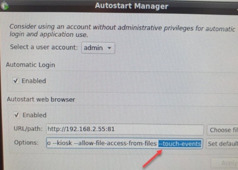

> 038PPC上的mappView画面中无法滑动

> Tags: #mappView #PPC

- [1 问题](#1%20%E9%97%AE%E9%A2%98)
- [2 解决方式](#2%20%E8%A7%A3%E5%86%B3%E6%96%B9%E5%BC%8F)
- [3 补充](#3%20%E8%A1%A5%E5%85%85)
- [4 关联问题](#4%20%E5%85%B3%E8%81%94%E9%97%AE%E9%A2%98)

# 1 问题

- 使用 Chrome 浏览器高版本（69 版本以上）在 PPC 硬件上访问 mappView 画面无法使用滑动手势效果
- 同样在有触摸屏的笔记本电脑上，也无法通过滑动手势控制 mappView 画面的控件滑动

# 2 解决方式

- 需要在启动 Chrome 时，增加 `--touch-events` 参数。
- 例如在 BR Linux 10 上，在 Autostart Manager 上 web browser 的 Options 增加如下参数
    - 

# 3 补充

- MappView 启动的 Options 参数推荐

```
--kiosk --incognito --touch-events --allow-file-access-files
```

# 4 关联问题

- [039如何创建与设置mappView画面访问快捷方式](../B05_技术_mapp/039如何创建与设置mappView画面访问快捷方式.md)
