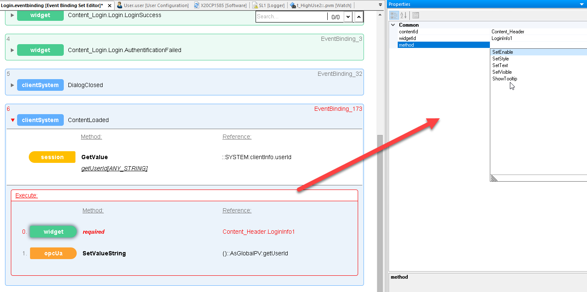

## 问题描述
客户在使用mappView时，想要获取当前登录用户信息，并将此信息反馈给下位程序做其他操作。

## 解决方式
可通过 mappView 的 session 变量来获取，如下图所示为 mappView 中 session 变量可获取的信息，其中“clientInfo.userId”为所需变量：

### 具体实现步骤如下
在 mappView 中做 EventAction,Enent 触发后，使用 Operands 获取当前用户信息，通过 Action，将获取到的当前用户信息给到所需的变量或控件；
Event 可选择任意 Events（可选项较多，此处测试使用 clientSystem.Event）：

属性中选择“ContentLoaded”:

Operands 选择“session.Operand”：

 

可进行如下配置：

operandName为此操作的名称，可自定义；
refId为所需获取的信息，可根据需求选择，这里选择“clientInfo.userId”

Action可根据实际需求自定义，可将获取到的信息给到某个控件，也可把获取到的信息给到指定变量，如下图，将获取到的当前登录用户信息给到了一个变量：

将程序下载，进行测试：
LoginInfo 控件读取到的当前用户信息：

程序监测到的当前用户信息：

可以看到两者信息一致

> 注：mappView是不能直接将LoginInfo控件获取到的当前用户信息赋值给其他变量或者控件的，这也是为什么需要另外做EventAction来实现的原因。

LoginInfo 控件可操作的属性如下图所示：

