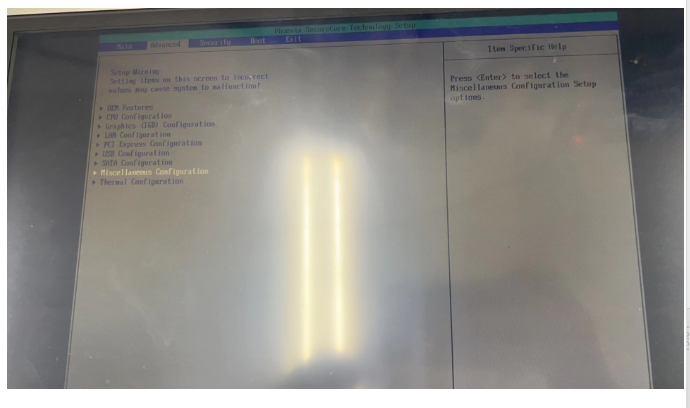
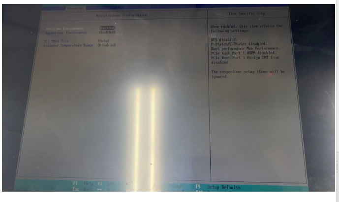

## 问题描述
对5APC2100进行Hypervisor安装时，报错“The PCI device specified in section[/PCI/1]cannot be explicitly assigned because it is configured for other purposes

## 解决方式
5APC2100安装Hypervisor需手动在BIOS中开启Hypervisor环境，如下图所示，使能“Hypervisor Environment”：

