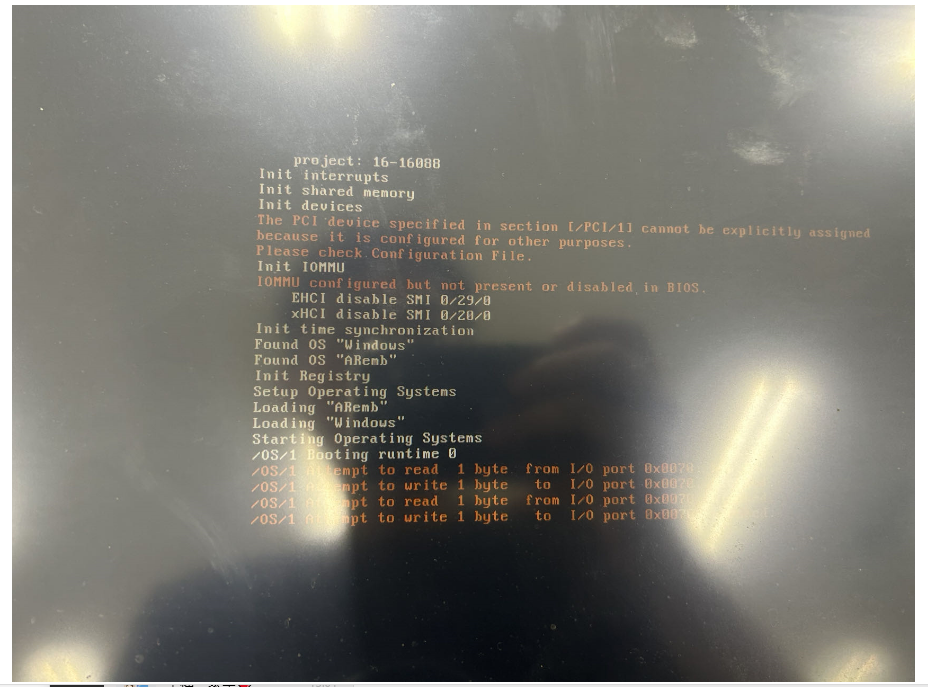
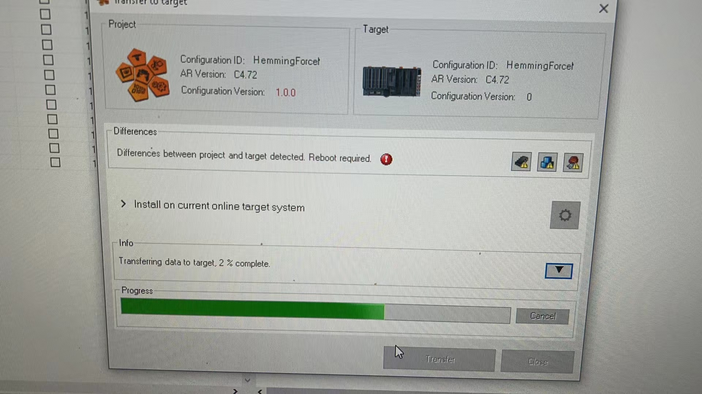

## 问题描述
对5APC2100进行Hypervisor安装时，报错“The PCI device specified in section[/PCI/1]cannot be explicitly assigned because it is configured for other purposes

## 解决方式
使用AS扫描到该设备，连接上该设备，transfer程序，transfer结束后，会重启设备，重启后正常进入系统。

