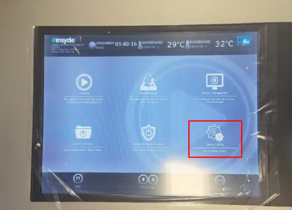
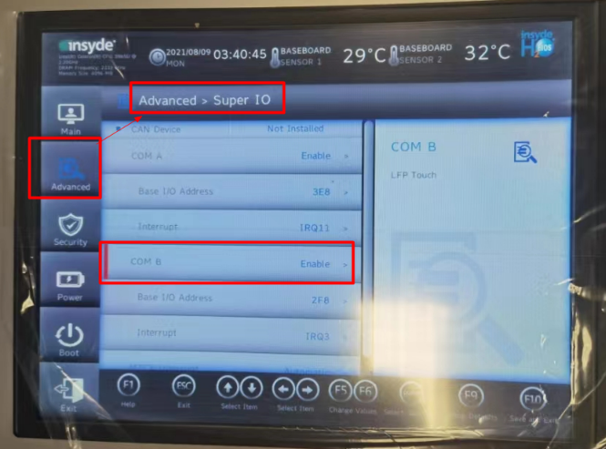
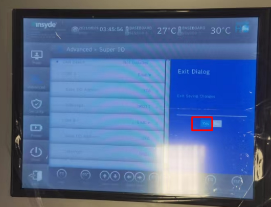
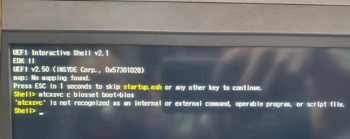
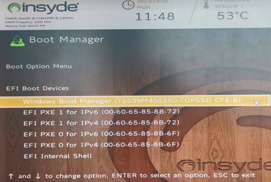
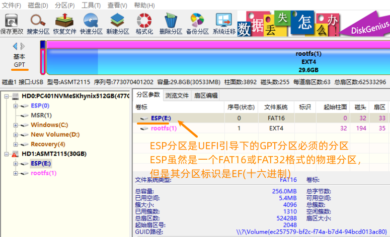
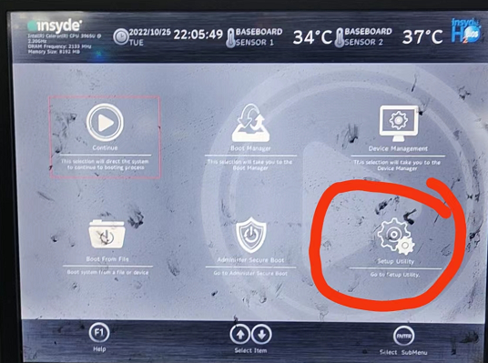
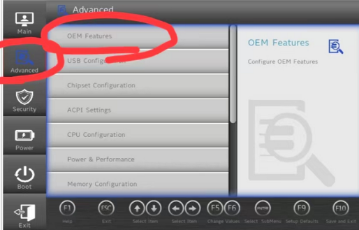
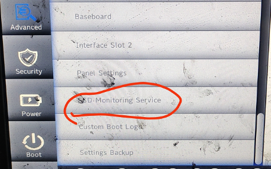
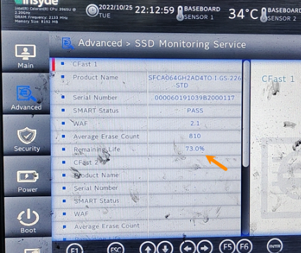

> #PPC #蓝屏 #黑屏

- [1 A03.039-PPC系列使用故障排查_黑屏_蓝屏_无反应](#_1-a03039-ppc%E7%B3%BB%E5%88%97%E4%BD%BF%E7%94%A8%E6%95%85%E9%9A%9C%E6%8E%92%E6%9F%A5%E9%BB%91%E5%B1%8F%E8%93%9D%E5%B1%8F_%E6%97%A0%E5%8F%8D%E5%BA%94)
- [2 触摸屏无反应](#_2-%E8%A7%A6%E6%91%B8%E5%B1%8F%E6%97%A0%E5%8F%8D%E5%BA%94)
	- [2.1 a.新机器出厂调试_仅限贝加莱原装且是新的屏幕](#_21-a%E6%96%B0%E6%9C%BA%E5%99%A8%E5%87%BA%E5%8E%82%E8%B0%83%E8%AF%95_%E4%BB%85%E9%99%90%E8%B4%9D%E5%8A%A0%E8%8E%B1%E5%8E%9F%E8%A3%85%E4%B8%94%E6%98%AF%E6%96%B0%E7%9A%84%E5%B1%8F%E5%B9%95)
	- [2.2 b.返修的屏幕或硬件](#_22-b%E8%BF%94%E4%BF%AE%E7%9A%84%E5%B1%8F%E5%B9%95%E6%88%96%E7%A1%AC%E4%BB%B6)
	- [2.3 c.现场正常使用的硬件，突然无法触摸](#_23-c%E7%8E%B0%E5%9C%BA%E6%AD%A3%E5%B8%B8%E4%BD%BF%E7%94%A8%E7%9A%84%E7%A1%AC%E4%BB%B6%EF%BC%8C%E7%AA%81%E7%84%B6%E6%97%A0%E6%B3%95%E8%A7%A6%E6%91%B8)
- [3 触摸屏黑屏_屏幕完全不亮](#_3-%E8%A7%A6%E6%91%B8%E5%B1%8F%E9%BB%91%E5%B1%8F_%E5%B1%8F%E5%B9%95%E5%AE%8C%E5%85%A8%E4%B8%8D%E4%BA%AE)
	- [3.1 a.新机器出厂调试_仅限贝加莱原装且是新的屏幕](#_31-a%E6%96%B0%E6%9C%BA%E5%99%A8%E5%87%BA%E5%8E%82%E8%B0%83%E8%AF%95_%E4%BB%85%E9%99%90%E8%B4%9D%E5%8A%A0%E8%8E%B1%E5%8E%9F%E8%A3%85%E4%B8%94%E6%98%AF%E6%96%B0%E7%9A%84%E5%B1%8F%E5%B9%95)
	- [3.2 b.返修的屏幕或硬件](#_32-b%E8%BF%94%E4%BF%AE%E7%9A%84%E5%B1%8F%E5%B9%95%E6%88%96%E7%A1%AC%E4%BB%B6)
	- [3.3 c.现场正常使用的硬件，突然无法触摸](#_33-c%E7%8E%B0%E5%9C%BA%E6%AD%A3%E5%B8%B8%E4%BD%BF%E7%94%A8%E7%9A%84%E7%A1%AC%E4%BB%B6%EF%BC%8C%E7%AA%81%E7%84%B6%E6%97%A0%E6%B3%95%E8%A7%A6%E6%91%B8)
- [4 触摸屏黑屏_上面有代码](#_4-%E8%A7%A6%E6%91%B8%E5%B1%8F%E9%BB%91%E5%B1%8F_%E4%B8%8A%E9%9D%A2%E6%9C%89%E4%BB%A3%E7%A0%81)
	- [4.1 参考相关信息](#_41-%E5%8F%82%E8%80%83%E7%9B%B8%E5%85%B3%E4%BF%A1%E6%81%AF)
	- [4.2 a.新机器出厂调试_仅限贝加莱原装且是新的屏幕](#_42-a%E6%96%B0%E6%9C%BA%E5%99%A8%E5%87%BA%E5%8E%82%E8%B0%83%E8%AF%95_%E4%BB%85%E9%99%90%E8%B4%9D%E5%8A%A0%E8%8E%B1%E5%8E%9F%E8%A3%85%E4%B8%94%E6%98%AF%E6%96%B0%E7%9A%84%E5%B1%8F%E5%B9%95)
	- [4.3 b.正常运行的机器](#_43-b%E6%AD%A3%E5%B8%B8%E8%BF%90%E8%A1%8C%E7%9A%84%E6%9C%BA%E5%99%A8)
	- [4.4 c.正常运行的机器，最近使用 USB 更新](#_44-c%E6%AD%A3%E5%B8%B8%E8%BF%90%E8%A1%8C%E7%9A%84%E6%9C%BA%E5%99%A8%EF%BC%8C%E6%9C%80%E8%BF%91%E4%BD%BF%E7%94%A8-usb-%E6%9B%B4%E6%96%B0)
- [5 触摸屏蓝屏](#_5-%E8%A7%A6%E6%91%B8%E5%B1%8F%E8%93%9D%E5%B1%8F)
	- [5.1 参考相关信息](#_51-%E5%8F%82%E8%80%83%E7%9B%B8%E5%85%B3%E4%BF%A1%E6%81%AF)
	- [5.2 a.新机器出厂调试_仅限贝加莱原装且是新的屏幕](#_52-a%E6%96%B0%E6%9C%BA%E5%99%A8%E5%87%BA%E5%8E%82%E8%B0%83%E8%AF%95_%E4%BB%85%E9%99%90%E8%B4%9D%E5%8A%A0%E8%8E%B1%E5%8E%9F%E8%A3%85%E4%B8%94%E6%98%AF%E6%96%B0%E7%9A%84%E5%B1%8F%E5%B9%95)
	- [5.3 b.返修的屏幕或硬件](#_53-b%E8%BF%94%E4%BF%AE%E7%9A%84%E5%B1%8F%E5%B9%95%E6%88%96%E7%A1%AC%E4%BB%B6)
	- [5.4 c.现场正常使用的硬件，突然无法蓝屏](#_54-c%E7%8E%B0%E5%9C%BA%E6%AD%A3%E5%B8%B8%E4%BD%BF%E7%94%A8%E7%9A%84%E7%A1%AC%E4%BB%B6%EF%BC%8C%E7%AA%81%E7%84%B6%E6%97%A0%E6%B3%95%E8%93%9D%E5%B1%8F)
	- [5.5 d.最近更新过程序](#_55-d%E6%9C%80%E8%BF%91%E6%9B%B4%E6%96%B0%E8%BF%87%E7%A8%8B%E5%BA%8F)
- [6 更新日志](#_6-%E6%9B%B4%E6%96%B0%E6%97%A5%E5%BF%97)

# 1 A03.039-PPC系列使用故障排查_黑屏_蓝屏_无反应

# 2 触摸屏无反应

触摸屏故障请参照以下情况进行分别排除：

## 2.1 a.新机器出厂调试_仅限贝加莱原装且是新的屏幕

- 1.触摸屏在新到工厂进行出机调试时，无法触摸。但是显示正常。可能是以下BIOS设置没有解锁，请按照以下步骤解锁触摸选项。
- 2.连接键盘至 PPC 的 USB 接口，触摸屏启动过程中，按 F2进入 BIOS，进入界面后，如下选择 Setup Utility
    - 
    - 进入 Advanced→Super IO → COM B 选择 “Enable”。
    - 
    - 按 F10，执行保存。
    - 
- 3.检查屏幕与背包之间的螺丝是否锁的过紧或者锁的过松。
- 4.检查24V接线端子是否紧固且电压正常，GND地线是否接好。进线24V电压是否稳定，且无短路。
- 5.目视检查屏幕是否有缺损或者划伤痕迹。
- 6.替换硬件检查。

## 2.2 b.返修的屏幕或硬件

- 1.检查屏幕与背包之间的螺丝是否锁的过紧或者锁的过松。
- 2.检查24V接线端子是否紧固且电压正常，GND地线是否接好。进线24V电压是否稳定，且无短路。
- 3.目视检查屏幕是否有缺损或者划伤痕迹。
- 4.替换硬件检查。
- 5.建议使用贝加莱的原装质保维修方案。

## 2.3 c.现场正常使用的硬件，突然无法触摸

- 1.检查屏幕与背包之间的螺丝是否锁的过紧或者锁的过松。
- 2.检查24V接线端子是否紧固且电压正常，GND地线是否接好。进线24V电压是否稳定，且无短路。
- 3.目视检查屏幕是否有缺损或者划伤痕迹。
- 4.替换硬件检查。

# 3 触摸屏黑屏_屏幕完全不亮

## 3.1 a.新机器出厂调试_仅限贝加莱原装且是新的屏幕

- 1.检查屏幕与背包之间的螺丝是否锁的过紧或者锁的过松。
- 2.检查24V接线端子是否紧固且电压正常，GND地线是否接好。进线24V电压是否稳定，且无短路。
- 3.目视检查屏幕是否有缺损或者划伤痕迹。
- 4.替换硬件检查。

## 3.2 b.返修的屏幕或硬件

- 1.检查屏幕与背包之间的螺丝是否锁的过紧或者锁的过松。
- 2.检查24V接线端子是否紧固且电压正常，GND地线是否接好。进线24V电压是否稳定，且无短路。
- 3.目视检查屏幕是否有缺损或者划伤痕迹。
- 4.替换硬件检查。
- 5.建议使用贝加莱的原装质保维修方案。

## 3.3 c.现场正常使用的硬件，突然无法触摸

- 1.检查屏幕与背包之间的螺丝是否锁的过紧或者锁的过松。
- 2.检查24V接线端子是否紧固且电压正常，GND地线是否接好。进线24V电压是否稳定，且无短路。特别是摇臂处电缆是否有破损或断芯。
- 3.目视检查屏幕是否有缺损或者划伤痕迹。
- 4.替换硬件检查。

# 4 触摸屏黑屏_上面有代码

- 如下图所示，如果触摸屏显示该界面时。
- 
- 可按照以下情况分别进行处理：

## 4.1 参考相关信息

- [⭐034PPC断电后开机显示startup.nsh界面](034PPC断电后开机显示startup.nsh界面.md)

## 4.2 a.新机器出厂调试_仅限贝加莱原装且是新的屏幕

- 1.使用更新 BIOS 的方式，进行 BIOS 默认启动方式修改。确认首先从 CFast 卡加载系统
    - 
- 2.使用 DiskGenius 软件检查 CFast 卡中分区文件系统情况，确认是否正常，例如 UEFI 启动方式，则 CFast 卡的分区表类型为 GPT，第一个分区为 ESP 分区。
    - 

## 4.3 b.正常运行的机器

- 1.检测 CFast 寿命，参考章节 **4.3触摸屏蓝屏** 的 BIOS 检测 CFast 卡寿命。

## 4.4 c.正常运行的机器，最近使用 USB 更新

- 1.检查触摸屏的背包控制器，检查 CFast 卡是否紧固在卡槽内，完整推进去再次紧固。
- 2.检测 CFast 寿命，参考章节 **4.3触摸屏蓝屏** 的 BIOS 检测 CFast 卡寿命。

# 5 触摸屏蓝屏

## 5.1 参考相关信息

- [036PPC屏幕断电上电后蓝屏](036PPC屏幕断电上电后蓝屏.md)
- [035PP500的屏升级了AR版本重新烧卡持续蓝屏](035PP500的屏升级了AR版本重新烧卡持续蓝屏.md)
- [001APC PPC工控机运行Automation Runtime时进入蓝屏显示error = 13 cant load boot file loading error](001APC%20PPC工控机运行Automation%20Runtime时进入蓝屏显示error%20=%2013%20cant%20load%20boot%20file%20loading%20error.md)

## 5.2 a.新机器出厂调试_仅限贝加莱原装且是新的屏幕

- 1.检查屏幕与背包之间的螺丝是否锁的过紧或者锁的过松。
- 2.检查24V接线端子是否紧固且电压正常，GND地线是否接好。进线24V电压是否稳定，且无短路。
- 3.目视检查屏幕是否有缺损或者划伤痕迹。
- 4.目视检查触摸屏，控制器之间是否存在异常硬件，如烧焦、发霉，异物侵入等明显缺陷。
- 5.替换硬件检查。

## 5.3 b.返修的屏幕或硬件

- 1.检查屏幕与背包之间的螺丝是否锁的过紧或者锁的过松。
- 2.检查24V接线端子是否紧固且电压正常，GND地线是否接好。进线24V电压是否稳定，且无短路。
- 3.目视检查屏幕是否有缺损或者划伤痕迹。
- 4.目视检查触摸屏，控制器之间是否存在异常硬件，如烧焦，发霉，异物侵入等明显缺陷。
- 5.替换硬件检查。
- 6.建议使用贝加莱的原装质保维修方案。

## 5.4 c.现场正常使用的硬件，突然无法蓝屏

- 1.检查屏幕与背包之间的螺丝是否锁的过紧或者锁的过松。
- 2.检查24V接线端子是否紧固且电压正常，GND地线是否接好。进线24V电压是否稳定，且无短路。特别是摇臂处电缆是否有破损或断芯。
- 3.目视检查屏幕是否有缺损或者划伤痕迹。
- 4.检查是否触摸屏与控制器是否有异物入侵，并检查CFast是否有松动，发霉，烧焦等痕迹。
- 5.检查CFast卡的读写寿命。注意，只能使用贝加莱原装的CFast卡，其他品牌的卡都可能导致系统异常不稳定。
    - 5.1接入键盘，并重启 ups。期间一直按 F2进入 BIOS.
    - 5.2点击 Setup Utility
        - 
    - 5.3点击 Advanced→OEM features 菜单下
        - 
    - 5.4下拉进度条，到 SSD monitoring service
        - 
    - 5.5拍照或检查当前的 Remaining Life（剩余寿命）
        - 
    - 5.6如果这个剩余寿命小于10%，则该卡处于临界故障阶段，建议更换。小于1%，则该卡彻底报废，必须更换。
- 6.替换硬件检查。

## 5.5 d.最近更新过程序

- 1.联系电气工程师，安装远程模块并连接网络，收集Logger以及System Dump信息，并打开Logger收集当前的错误代码。参考后面的章节。
- 2.如果出现蓝屏，可能是24V 断了，此时屏幕依旧是会重启启动，并会重新进入界面。但如果是异常会导致屏幕一直卡在蓝屏阶段，此时无论何种原因导致，建议联系电气工程师，并安装好远程模块，由电气工程师采集数据并进行分析。

# 6 更新日志

| 日期         | 修改人 | 修改内容      |
| :--------- | :-- | :-------- |
| 2024-04-27 | YZY | 调整格式，补充信息 |
