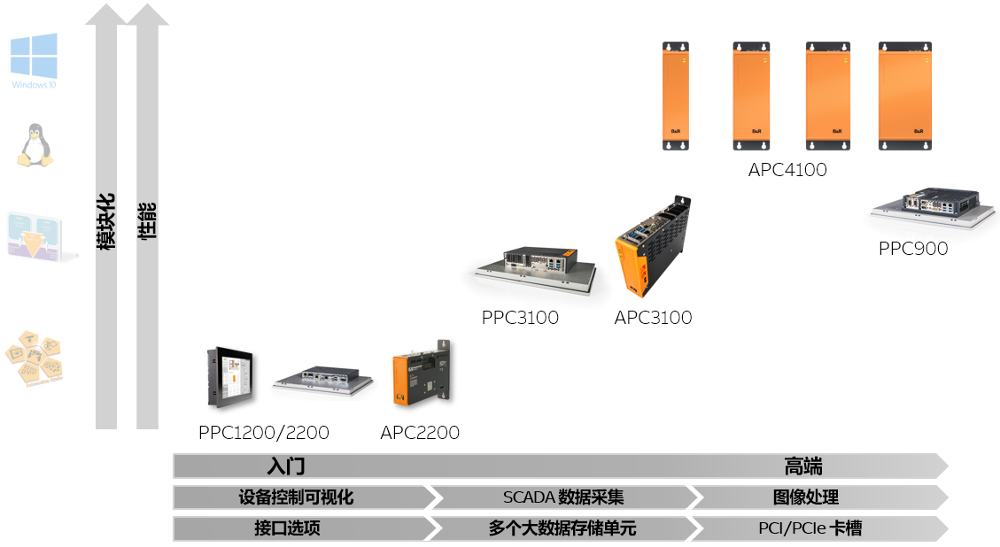

> Tags: #工控机 #APC4100

- [1 贝加莱官方链接](#1%20%E8%B4%9D%E5%8A%A0%E8%8E%B1%E5%AE%98%E6%96%B9%E9%93%BE%E6%8E%A5)
- [2 贝加莱产品体系](#2%20%E8%B4%9D%E5%8A%A0%E8%8E%B1%E4%BA%A7%E5%93%81%E4%BD%93%E7%B3%BB)
- [3 Automation PC 4100](#3%20Automation%20PC%204100)
	- [3.1 特点](#3.1%20%E7%89%B9%E7%82%B9)
	- [3.2 接口](#3.2%20%E6%8E%A5%E5%8F%A3)
	- [3.3 CPU性能对比](#3.3%20CPU%E6%80%A7%E8%83%BD%E5%AF%B9%E6%AF%94)
- [4 Panel PC 2200](#4%20Panel%20PC%202200)
	- [4.1 基本参数](#4.1%20%E5%9F%BA%E6%9C%AC%E5%8F%82%E6%95%B0)
	- [4.2 接口](#4.2%20%E6%8E%A5%E5%8F%A3)
	- [4.3 屏幕特点](#4.3%20%E5%B1%8F%E5%B9%95%E7%89%B9%E7%82%B9)
- [5 Panel PC 3100](#5%20Panel%20PC%203100)
	- [5.1 基本参数](#5.1%20%E5%9F%BA%E6%9C%AC%E5%8F%82%E6%95%B0)
	- [5.2 接口](#5.2%20%E6%8E%A5%E5%8F%A3)
- [6 Panel PC 900](#6%20Panel%20PC%20900)
	- [6.1 基本参数](#6.1%20%E5%9F%BA%E6%9C%AC%E5%8F%82%E6%95%B0)
	- [6.2 接口](#6.2%20%E6%8E%A5%E5%8F%A3)
- [7 更新日志](#7%20%E6%9B%B4%E6%96%B0%E6%97%A5%E5%BF%97)

# A03.040-产品介绍_APC与PPC系列

# 1 贝加莱官方链接

- [Industrial PCs | B&R Industrial Automation (br-automation.com)](https://www.br-automation.com/en/products/industrial-pcs/)

# 2 贝加莱产品体系

- 
- 

# 3 Automation PC 4100

## 3.1 特点

- 适用于各种应用的可扩展性能
    - 可个性化配置
- 性价比更高
    - 11th 代英特尔处理器 "Tiger-Lake“
    - Celeron, Core I 与 Xeon
    - 高能效
- 专为多年 24/7 全天候运行开发
    - 在最恶劣条件下进行测试
    - 易维护
    - 无风扇选项
- SDRAM
    - 最大支持 64 GB DRAM
    - 选定的 ECC 版本（可选，取决于 CPU）
- 支持人工智能和图形卡
    - 最大支持 PCI Express x16 slot, Gen 4
    - 最大支持 3x PCI/PCIe
- 扩展连接性
    - 板载多达 4x 千兆位以太网（取决于 CPU）
    - OPC UA TSN
- 具有高速数据速率的多种大容量存储选项
    - 2x CFexpress 最大至 480 GB
        - 性价比更高
        - 通过PCIe连接
        - RAID成为可能
    - 2x SSD/HDD 最大至 1 TB
        - RAID 成为可能
    - M.2 最大至 1 TB
- 

## 3.2 接口

- 

## 3.3 CPU性能对比

- 

# 4 Panel PC 2200

## 4.1 基本参数

- Intel Atom Apollo Lake processors
    - E3930 1.3 GHz 双核
    - E3940 1.6 GHz 四核
    - TPM 2.0
- 无风扇
- 操作系统
    - Windows 10 IoT Enterprise
    - Automation Runtime Embedded
    - Linux

## 4.2 接口

- 

## 4.3 屏幕特点

- 多点触控从 7“ 到 24"
- 单点触控从 5.7“ 到 19"
- 面板安装设备
- 摇臂设备
- 

# 5 Panel PC 3100

## 5.1 基本参数

- 可扩展的性能
    - Intel Celeron 与 Core i 处理器
    - 最多 32 GB SDRAM
- 2个接口卡插槽
- 2 Cfast卡插槽
- 无风扇
- 操作系统
    - Windows 10 IoT Enterprise
    - Automation Runtime Embedded
    - Linux
    - Hypervisor

## 5.2 接口

- 

# 6 Panel PC 900

## 6.1 基本参数

- 可扩展的性能
    - Intel Celeron 与 Core i 处理器
    - 最多 16 GB SDRAM
- 2 接口卡插槽
    - Serial, POWERLINK, CAN, UPS
- 可选 PCI/PCI Express 槽位
- 操作系统
    - Windows 10 IoT Enterprise
    - Automation Runtime Embedded
    - Linux
    - Hypervisor

## 6.2 接口

- 

# 7 更新日志

| 日期         | 修改人 | 修改内容 |
| :--------- | :-- | :--- |
| 2023-12-15 | YZY | 初次创建 |
