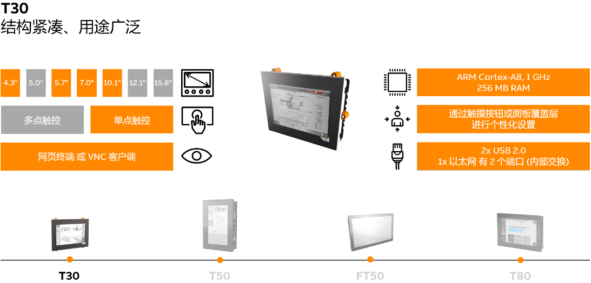
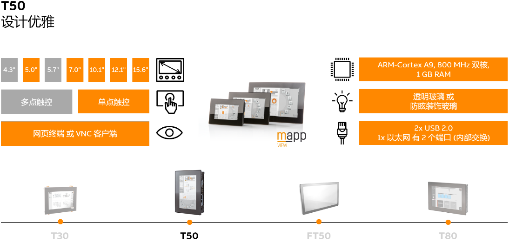
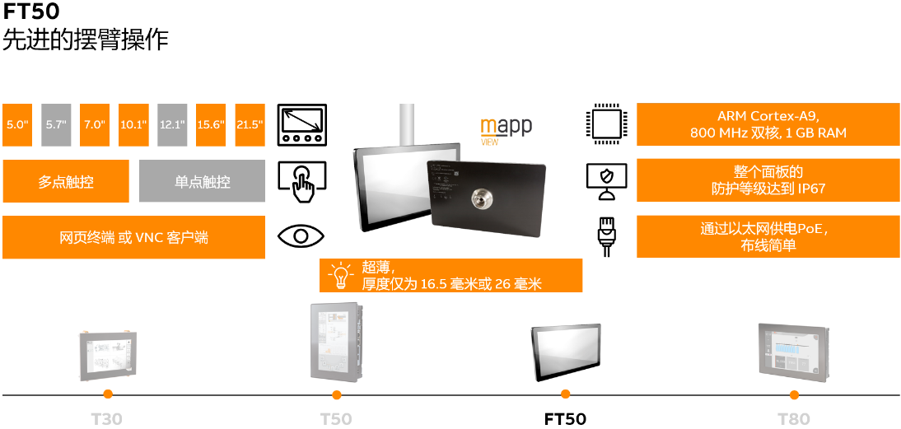
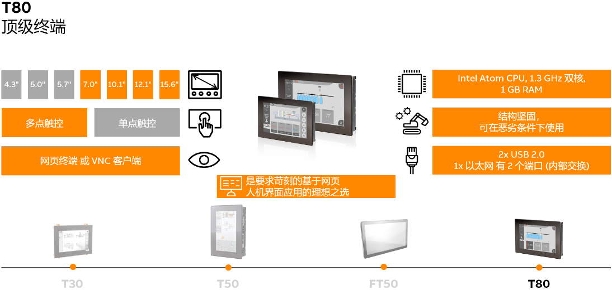
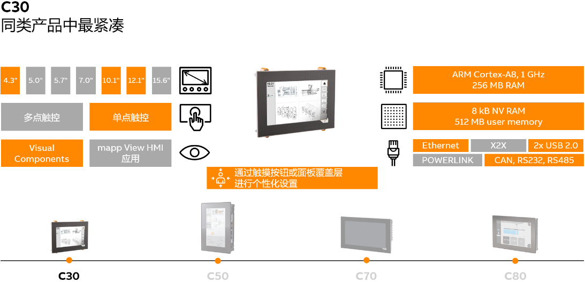
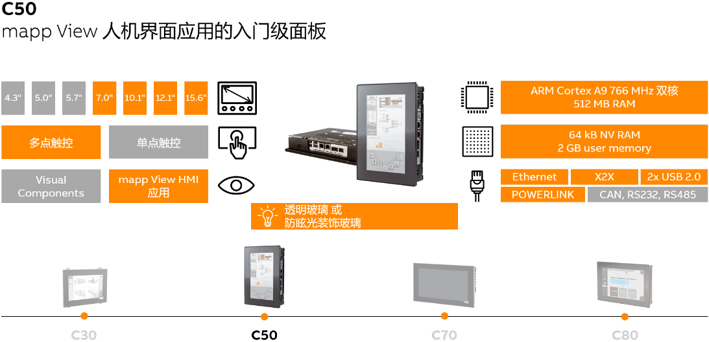
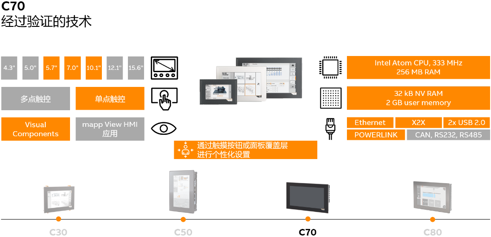
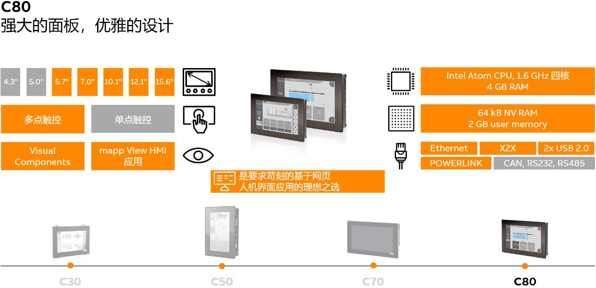

> 041产品介绍_PowerPanel系列

> Tags: #T50 #T80

- [T30](#T30)
- [T50](#T50)
- [FT50](#FT50)
- [T80](#T80)
- [C30](#C30)
- [C50](#C50)
- [C70](#C70)
- [C80](#C80)
- [更新日志](#%E6%9B%B4%E6%96%B0%E6%97%A5%E5%BF%97)

# T30

- 

# T50

- 

# FT50

- 

# T80

- 

# C30

- 

# C50

- 

# C70

- 

# C80

- 

# 更新日志

| 日期     | 修改人     | 修改内容     |
|:-----|:-----|:-----|
| 2023-12-15     | YuanZhiyi     | 初次创建     |
