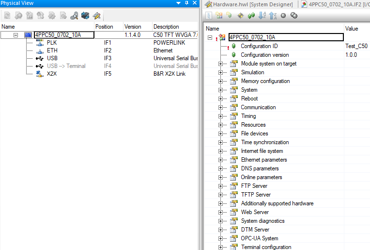
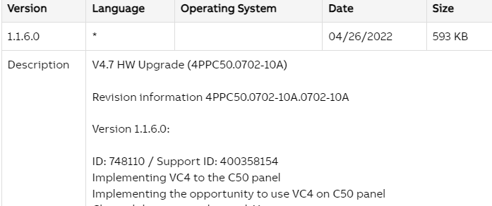
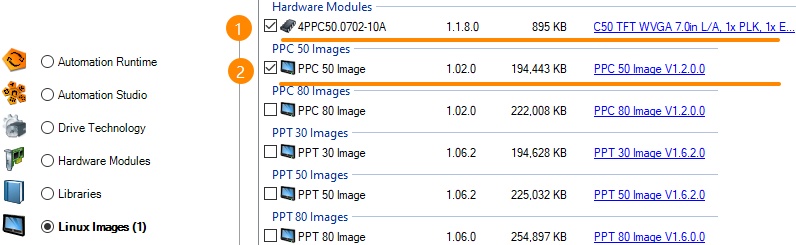
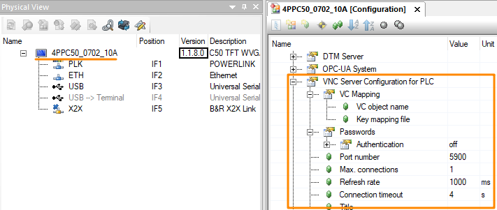
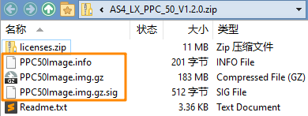
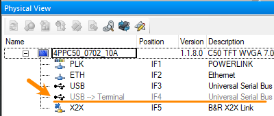
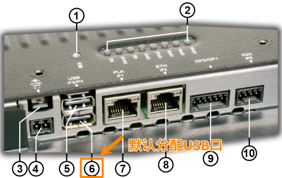

> Tags: #C50 #VC4

- [1 042贝加莱C50硬件如何支持VC4画面显示](#1%20042%E8%B4%9D%E5%8A%A0%E8%8E%B1C50%E7%A1%AC%E4%BB%B6%E5%A6%82%E4%BD%95%E6%94%AF%E6%8C%81VC4%E7%94%BB%E9%9D%A2%E6%98%BE%E7%A4%BA)
- [2 需求](#2%20%E9%9C%80%E6%B1%82)
- [3 ✔️C50在1.1.6.0固件版本后，支持VC4显示](#3%20%E2%9C%94%EF%B8%8FC50%E5%9C%A81.1.6.0%E5%9B%BA%E4%BB%B6%E7%89%88%E6%9C%AC%E5%90%8E%EF%BC%8C%E6%94%AF%E6%8C%81VC4%E6%98%BE%E7%A4%BA)
- [4 更新C50支持VC4方式](#4%20%E6%9B%B4%E6%96%B0C50%E6%94%AF%E6%8C%81VC4%E6%96%B9%E5%BC%8F)
	- [4.1 在Automation Studio软件下更新固件](#4.1%20%E5%9C%A8Automation%20Studio%E8%BD%AF%E4%BB%B6%E4%B8%8B%E6%9B%B4%E6%96%B0%E5%9B%BA%E4%BB%B6)
	- [4.2 在C50硬件上更新操作系统镜像](#4.2%20%E5%9C%A8C50%E7%A1%AC%E4%BB%B6%E4%B8%8A%E6%9B%B4%E6%96%B0%E6%93%8D%E4%BD%9C%E7%B3%BB%E7%BB%9F%E9%95%9C%E5%83%8F)
- [5 更新日志](#5%20%E6%9B%B4%E6%96%B0%E6%97%A5%E5%BF%97)

# 1 042贝加莱C50硬件如何支持VC4画面显示

# 2 需求

- 贝加莱C50硬件原本无法显示Visual Component 4 画面，只能显示mappView画面。
- 是否有方式使C50硬件支持显示VC4画面
- 如下图中，C50硬件的配置选项中没有VC4画面配置的选项
- 

# 3 ✔️C50在1.1.6.0固件版本后，支持VC4显示

- 总部官网链接
    - [V4.7 HW Upgrade (4PPC50.0702-10A) | B&R Industrial Automation (br-automation.com)](https://www.br-automation.com/en/downloads/software/automation-studio/hw-upgrades/v47-hw-upgrade-4ppc500702-10a/)
- 内容说明
    - 

# 4 更新C50支持VC4方式

## 4.1 在Automation Studio软件下更新固件

- 通过Automation Studio，更新安装C50最新版本的**硬件固件**与PPC50 Image **镜像**
- 
- 更新完成后，即可在C50硬件选项配置中看到VC4配置选项
- 

## 4.2 在C50硬件上更新操作系统镜像

- 前往贝加莱官网，下载更新镜像压缩包
    - [V4.7 LX Upgrade PPC50 ZIP | B&R Industrial Automation (br-automation.com)](https://www.br-automation.com/en/downloads/industrial-pcs-and-panels/power-panel-t-c-series/power-panel-c50/v47-lx-upgrade-ppc50-zip/)
    - 
- 下载完成后，以下三个文件，拷贝U盘
    - PPC50Image.img.gz
    - PPC50Image.info
    - PPC50Image.img.gz.sig
- 将U盘，插在C50硬件的USB口
    - 默认是IF4口，即在AS项目中分配给Terminal的USB端口
    - 
    - 
- C50断电再上电，即自动更新
    - 默认设置下，C50设备断电上后，会自动扫描搜索与当前终端操作系统不同的有效终端操作系统映像并加载。
    - 若C50重启后没有更新，请在C50系统上，设置Update → Trigger → Automatic
    - 也可以在C50 的屏幕显示上，点击Update → Trigger 点击触发进行更新

# 5 更新日志

| 日期     | 修改人     | 修改内容     |
|:-----|:-----|:-----|
| 2024-01-17     | YuanZhiyi DingHanzhou     | 初次创建     |
